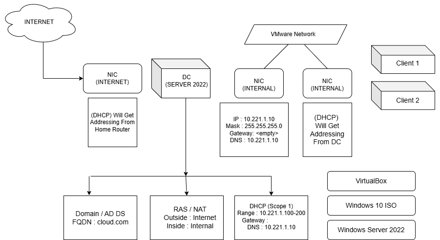

# 🧠 Planning & Lab Overview

## 📝 1. Objectives

The goal of this lab was to simulate a small enterprise Active Directory environment to sharpen my cybersecurity and IT administration skills. I focused on hands-on configuration of key services including:

- Domain Controller deployment using **Windows Server 2022**
- Client domain joining with **Windows 10 Pro**
- Implementation of **Group Policy Objects (GPOs)** for security and user management
- Configuration of DNS, firewall rules, folder redirection
- Testing and troubleshooting AD-related issues

---

## 🖼️ 2. Architecture Diagram

The diagram below illustrates the network structure, including the domain controller, two client machines, and how they are logically connected.

📸 **Lab Architecture**  

---

## 🛠️ 3. Lab Components

| Component             | Details                       |
|-----------------------|-------------------------------|
| **Domain**            | cloud.com                     |
| **Domain Controller** | Windows Server 2022           |
| **Clients**           | Windows 10 Pro (x2)           |
| **Virtualization**    | VirtualBox                    |
| **Network Type**      | Internal Network (VirtualBox) |

---

## ✅ 4. Pre-Requisites

Before building the lab, I ensured the following were in place:

- A host system with at least 16GB RAM and 465 GB disk space
- VirtualBox installed and working properly
- ISO files for Windows Server 2022 and Windows 10 Pro
- Network properly configured to allow domain communication
- Basic understanding of AD, DNS, and GPO concepts

---

## 🔍 5. Planning Considerations

- Used static IPs for all virtual machines to ensure consistent connectivity.
- Ensured Windows Server had proper DNS and time sync.
- Selected features and policies aligned with real-world enterprise best practices.
- Documented each configuration step with screenshots and explanations.

---

## 6. 📁 Screenshot Storage

All screenshots for this section can be found in:  
📂 [`06-Screenshots/A-Planning/01`](../06-Screenshots/A-Planning)
