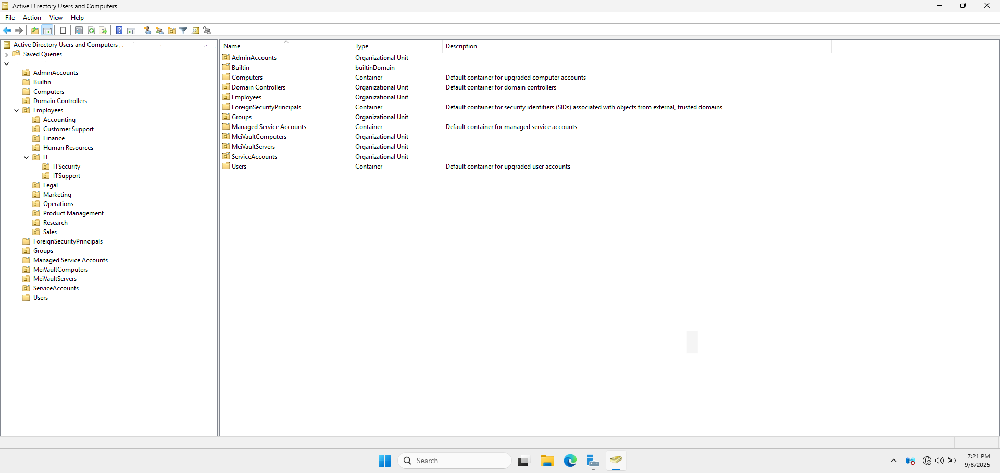
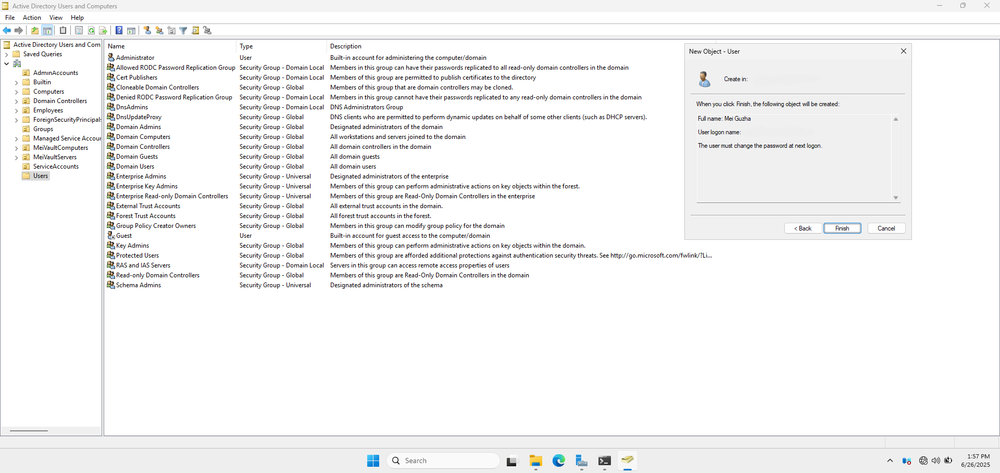
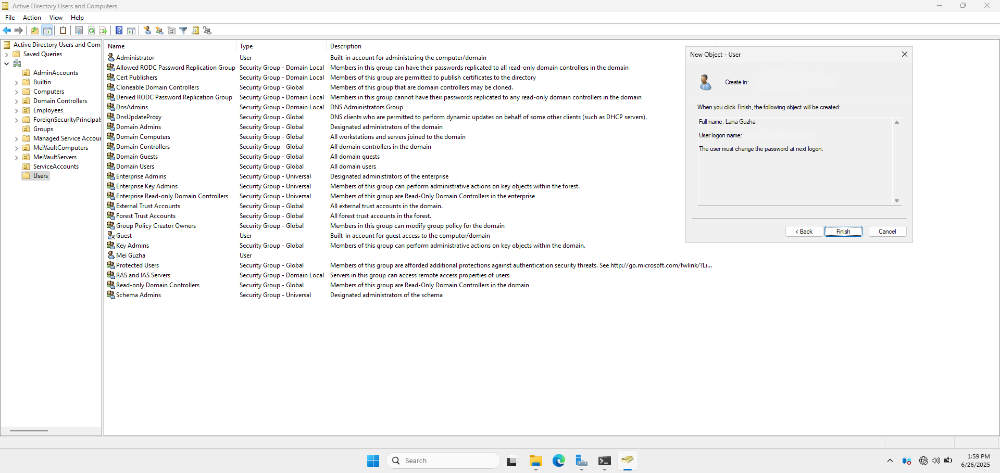
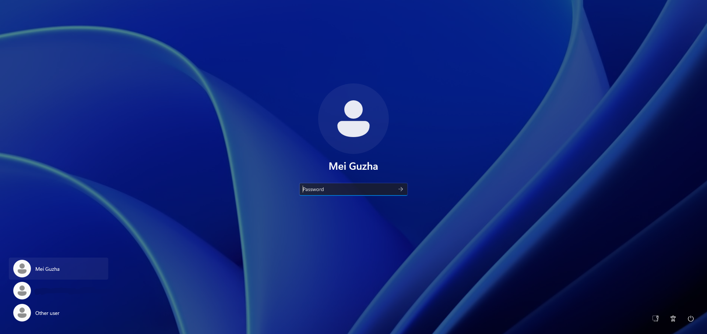
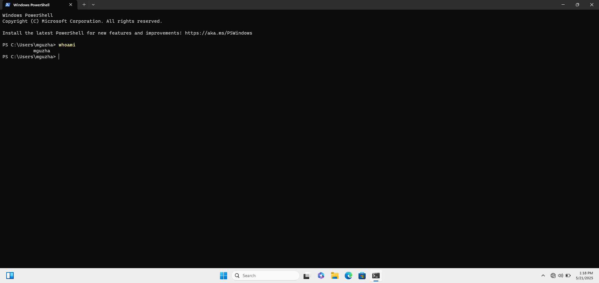
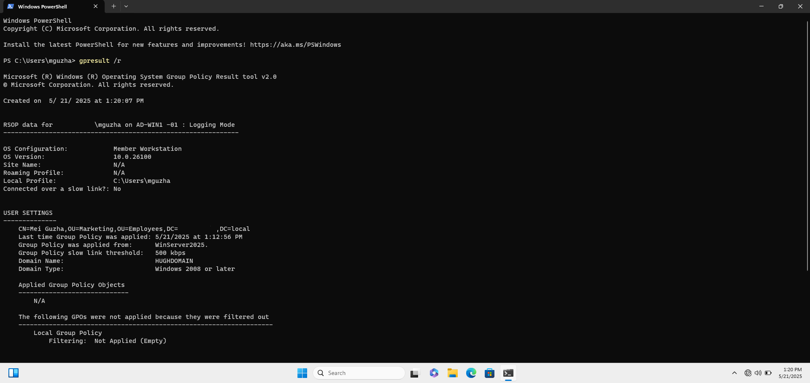

# 🏢 Active Directory Setup

This section outlines how I configured **Active Directory Domain Services (AD DS)** on the Windows Server 2022 Domain Controller and organized the domain structure using **Organizational Units (OUs)**, **users**, and **security groups**.

---

## 🧱 1. Domain Creation

After installing the AD DS role on the server, I promoted it to a Domain Controller with the following settings:

- **Domain Name:** cloud.com 
- **NetBIOS Name:**  Kiran
- **Forest Functional Level:** Windows Server 2022 
- **Domain Functional Level:** Windows Server 2022  
- **DNS Server Role:** Installed and configured  
- **Global Catalog:** Enabled  
- **Directory Services Restore Mode (DSRM) Password:** Set securely  

**Server Manager Summary Before Installation**
**Domain Promotion Wizard Final Confirmation Screen**

📸 **Command Prompt with Ipconfig all Showing Domain Suffix**


---

## 🗂️ 2. Organizational Unit (OU) Structure

I created the following OUs to organize domain objects:

```
cloud.com
├── AdminAccounts
├── Builtin
├── Computers
├── Domain Controllers
├── Employees
  ├── Accounting
  ├── Customer Support 
  ├── Finance 
  ├── Human Resources 
  ├── IT
    ├── ITSecurity
    ├── ITSupport
  ├── Legal 
  ├── Marketing
  ├── Operations
  ├── Product Management
  ├── Research
  ├── Sales
├── ForeignSecurityPrincipals
├── Groups
├── Managed Service Accounts
├── MeiVaultComputers
├── MeiVaultServers
├── ServiceAccounts
├── Users
````
Each department OU will be used for GPO targeting and permission management.

📸 **Active Directory Users and Computers (ADUC) Showing OU Structure**



---

## 👤 3. User Account Creation

Using both the **ADUC GUI** and **PowerShell**, I created domain user accounts:

### Example Users:
| Username            | Full Name        | Department       | OU Placement      |
|---------------------|------------------|------------------|-------------------|
| **BUAdmin1**        | Backup Admin     | Admins           | Admins            |
| **BUAdmin2**        | Backup Admin1    | Admins           | Admins            |
| **lguzha**          | Lana Guzha       | IT               | IT Support        |
| **mguzha**          | Mei Guzha        | IT               | IT Support        |
| **TechUser1**       | Tech User1       | IT               | IT Security       |
| **TechUser2**       | Tech User2       | IT               | IT Security       |

Passwords were set to expire and require change on first login (except admin accounts).

📸 **New User Creation Wizard in ADUC for Mei Guzha**



📸 **New User Creation Wizard in ADUC for Lana Guzha**



---

## 👥 4. Group Creation and Nesting

I created security groups for access control and GPO scoping:

### Examples:
| Group Name                           | Type     | Scope  | Description                                       |
|--------------------------------------|----------|--------|---------------------------------------------------|
| **Administrators**                   | User     |        | Built-in; Admin privileges                        |
| **BUAdmin1**                         | User     |        | Admin privileges                                  |
| **BUAdmin2**                         | User     |        | Admin privileges                                  |
| **CustomerSupport-managers**         | Security | Global | Granted local admin on customer support PCs       |
| **Domain Admins**                    | Security | Global | Built-in; Admin privileges                        |
| **Accounting-Managers**              | Security | Global | Granted local admin on accounting PCs             |
| **CustomerSupport-Managers**         | Security | Global | Granted local admin on customer support PCs       |
| **Finance-Managers**                 | Security | Global | Granted local admin on finance PCs                |
| **Human Resources-Managers**         | Security | Global | Granted local admin on human resources PCs        |
| **IT-Managers**                      | Security | Global | Granted local admin on IT management PCs          |
| **ITSecurity-Managers**              | Security | Global | Granted local admin on IT security PCs                     |
| **ITSupport-Managers**               | Security | Global | Granted local admin on IT support PCs             |
| **Legal-Managers**                   | Security | Global | Granted local admin on legal PCs                  |
| **Marketing-Managers**               | Security | Global | Granted local admin on marketing PCs              |
| **Operations-Managers**              | Security | Global | Granted local admin on operations PCs             |
| **ProductManagement-Managers**       | Security | Global | Granted local admin on product Management PCs     |
| **Research-Managers**                | Security | Global | Granted local admin on research & Development PCs |
| **Sales-Managers**                   | Security | Global | Granted local admin on sales PCs                  |

🔁 Group nesting was applied where relevant (e.g., IT-Support inside IT-Managers).

## 🏢 Properties Window Showing Group Membership

**Administrators Group Membership**
**Domain Administrators Groups Membership**
**Enterprise Administrators Groups Membership**
**Accounting Managers Membership**
**CustomerSupport Managers Membership**
**Finance Managers Membership**
**Human Resources Managers Membership**
**IT Managers Membership**
**IT Security Membership**
**IT Support Membership**
**Legal Managers Membership**
**Marketing Managers Membership**
**Operations Managers Membership**
**Product Management Managers Membership**
**Research Managers Membership**
**Sales Managers Membership**

---

## 🧪 5. Validation & Testing

To confirm everything worked:

- Logged in as a domain user on a Windows 10 client  
- Verified group memberships and access rights  
- Ran `gpresult /r` to ensure correct GPO application  
- Ensured all created objects appeared correctly in ADUC

📸 **Login Screen Showing Domain User for `AD-WIN10-01`**



📸 **Output from `whoami` Command for `AD-WIN10-01`**



📸 **Output from `gpresult` Command for `AD-WIN10-01`**


