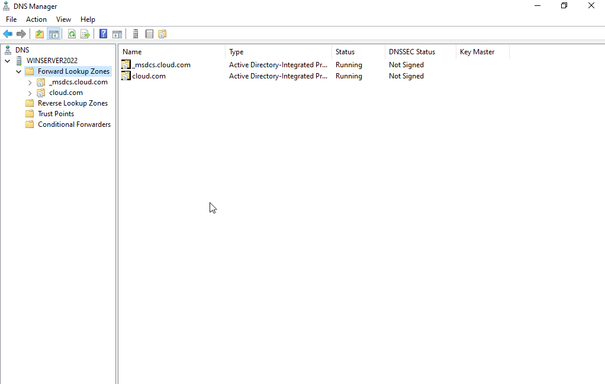
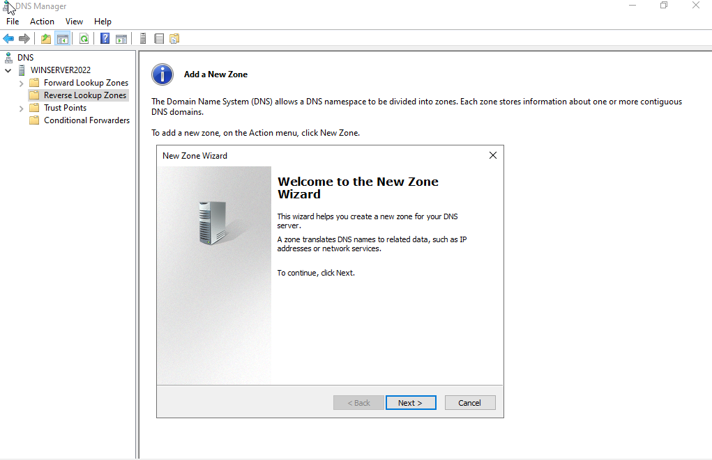
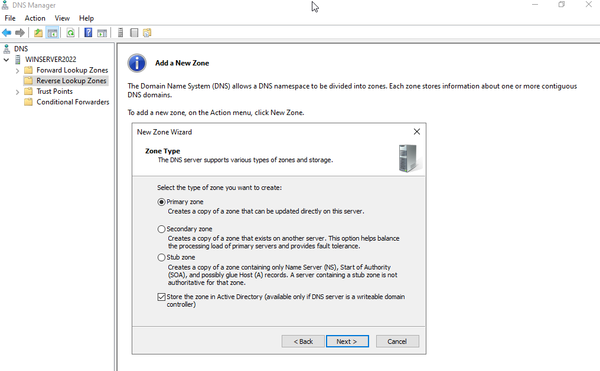
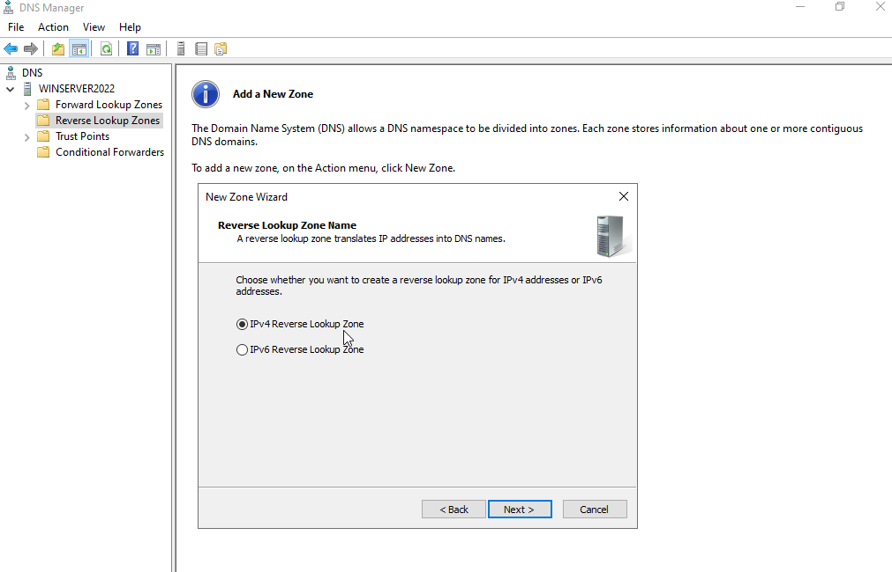
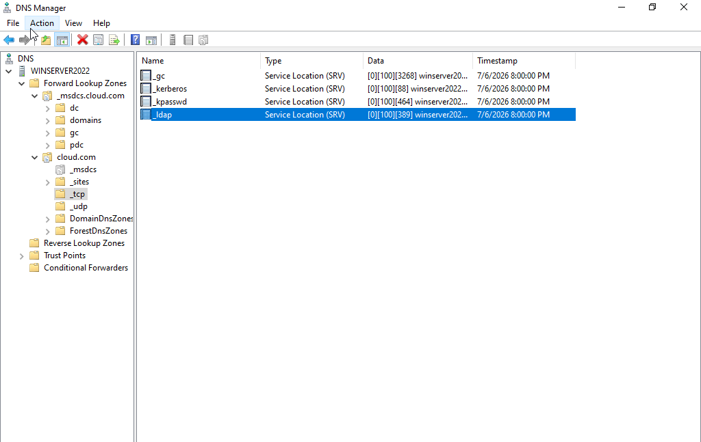
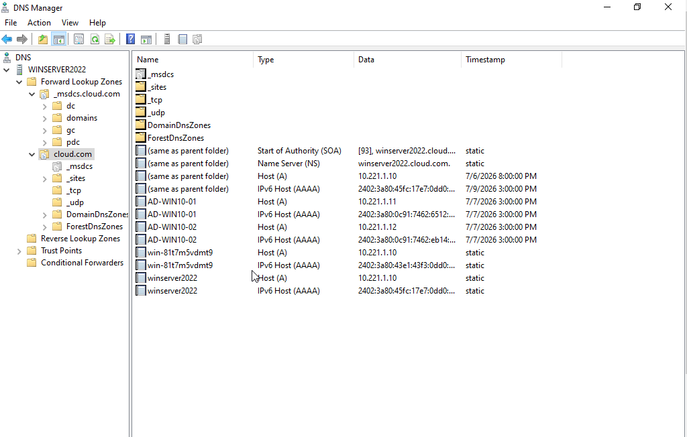
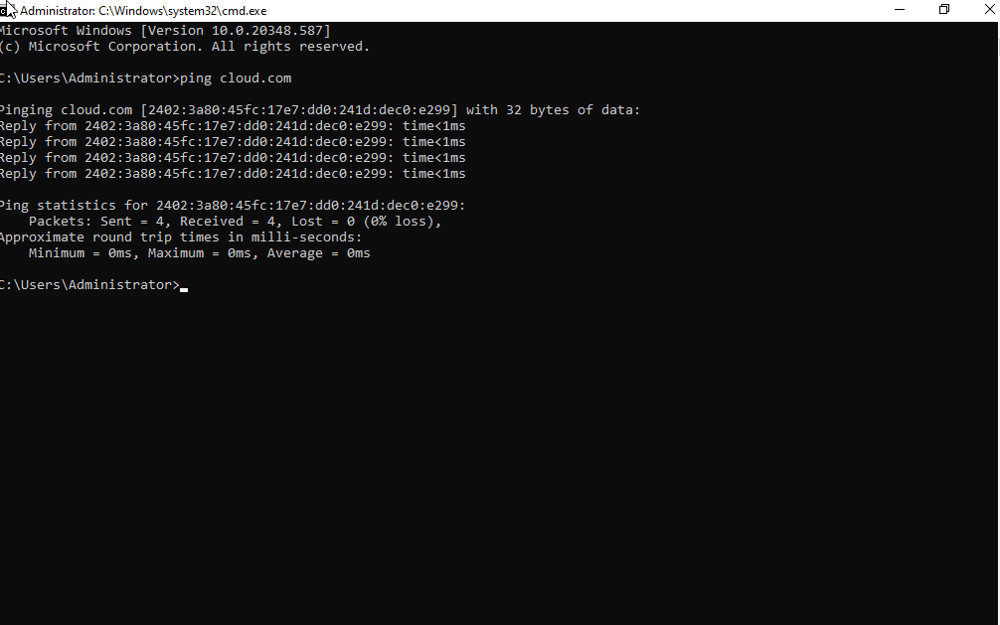
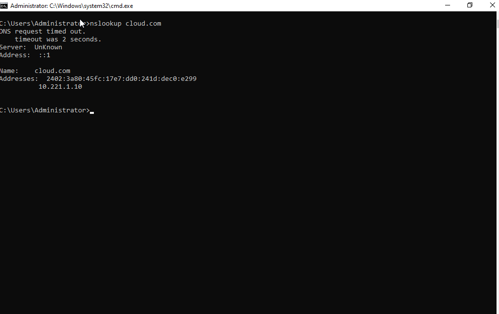
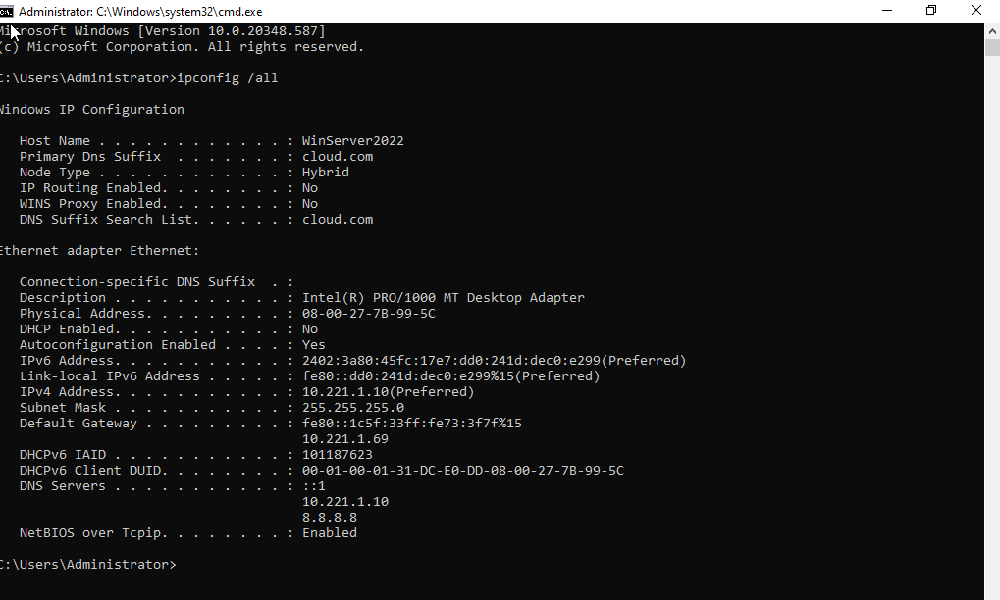

# 🌐 DNS Configuration for Active Directory

This section details how I configured the **Domain Name System (DNS)** on my Windows Server 2022 Domain Controller to ensure proper name resolution within the domain environment.

---

## ⚙️ 1. DNS Role Configuration

During the **Active Directory Domain Services (AD DS)** installation and domain promotion process, the **DNS Server** role was installed automatically.

### Key Settings Verified:
- Forward Lookup Zone: `cloud.com` (Active Directory–integrated)
- Reverse Lookup Zone: Created
- Secure dynamic updates enabled

📸 **DNS Manager Showing Forward Lookup Zone for cloud.com**



📸 **Reverse Lookup Zone Creation Wizard**



📸 **Reverse Lookup Zone Type**



📸 **Reverse Lookup Zone Name**



---

## 🗂️ 2. Forward Lookup Zone Configuration

Within the **Forward Lookup Zone**, I verified the creation of:

- **Host (A)** records for:
  - Domain Controller: `WinServer2022` ➝ `10.221.1.10`
  - Windows 10 clients: `AD-WIN10-01`, `AD-WIN10-02`
- **_msdcs** subdomain (used for AD replication and services)
- SRV Records for:
  - `_ldap._tcp.dc._msdcs.cloud.com`
  - `_kerberos._tcp.dc._msdcs.cloud.com`

📸 **DNS Manager with `msdcs` and SRV Records Visible**



📸 **Host Records for Domain Members**



---

## 🔄 3. Reverse Lookup Zone Setup

To support name resolution from IP → hostname, I manually created a **Reverse Lookup Zone**:

- **Type:** Primary, AD-integrated
- Enabled secure dynamic updates

Verified PTR records for:
- `10.221.1.10` ➝ `WinServer2022`
- `10.221.1.11` ➝ `AD-WIN10-01`
- `10.221.1.12` ➝ `AD-WIN10-02`

---

## 🧪 4. DNS Testing & Verification

To ensure everything worked:

**On the Domain Controller:**
- Ran `nslookup` and `ping` commands for hostname and IP resolution  
- Verified that domain services could be located via:

  ```powershell
  nslookup -type=SRV _ldap._tcp.dc._msdcs.cloud.com
  ```

    ```powershell
  nslookup -type=SRV _kerberos._tcp.dc._msdcs.cloud.com
  ```

    ```powershell
  dcdiag /test:dns /v
  ```
  
📸 **Output from `ping` Commands for Hostname and IP Resolution**



📸 **Output from `nslookup` Commands for Hostname and IP Resolution**



📸 **Command Prompt with `Ipconfig all` Showing Domain Suffix**



**On Client Machines:**
- Used `nslookup` to confirm the DNS server `(10.221.1.10)` was responding
- Ran `gpupdate /force` and `gpresult /r` to check successful GPO delivery

📸 **Output from `nslookup` to Confirm the DNS Server Response for `AD-WIN10-01`**


