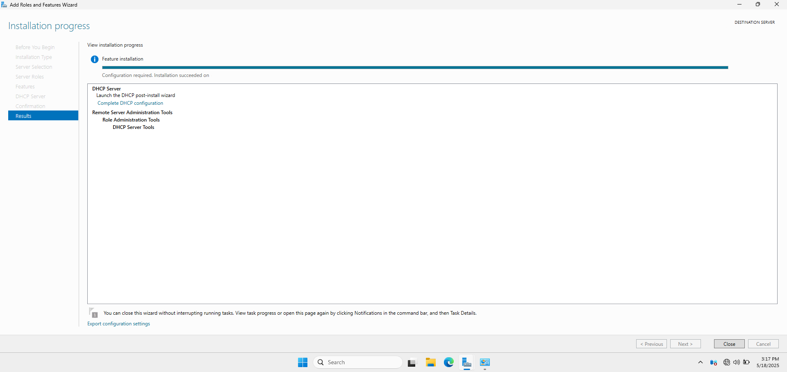
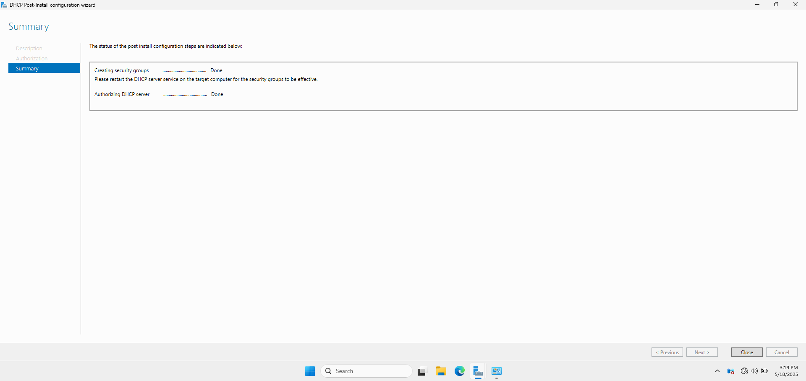
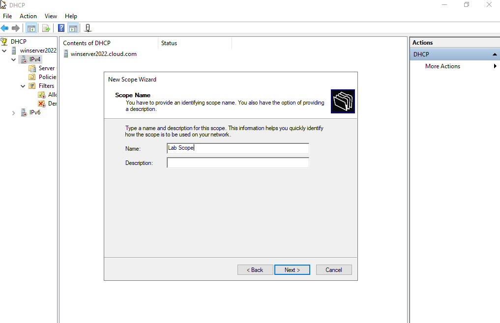
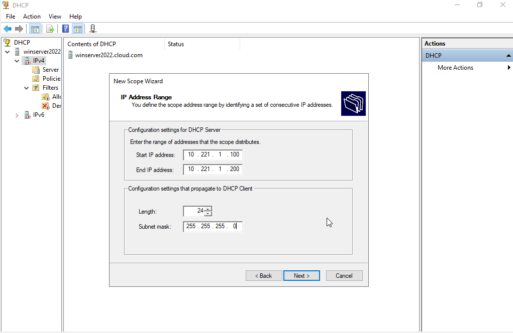
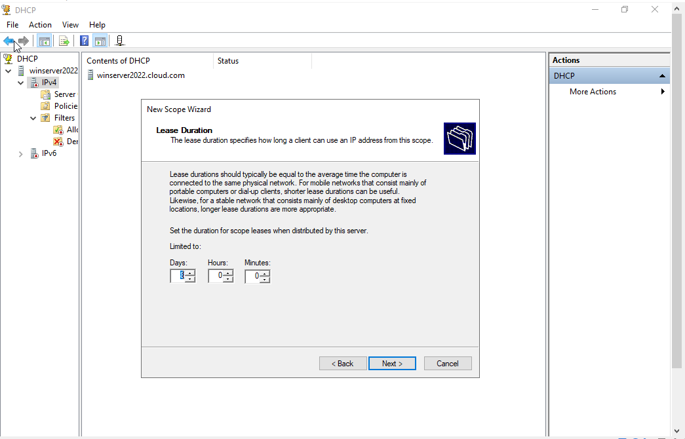
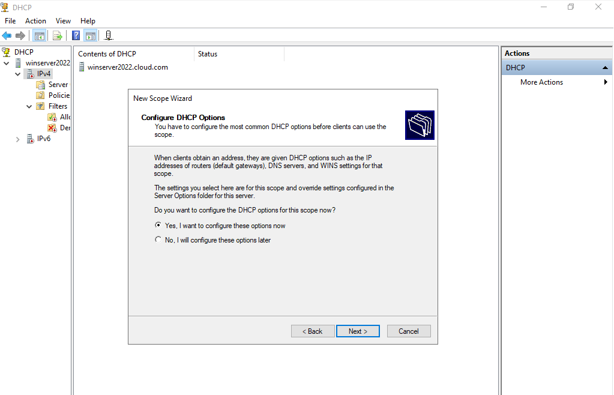
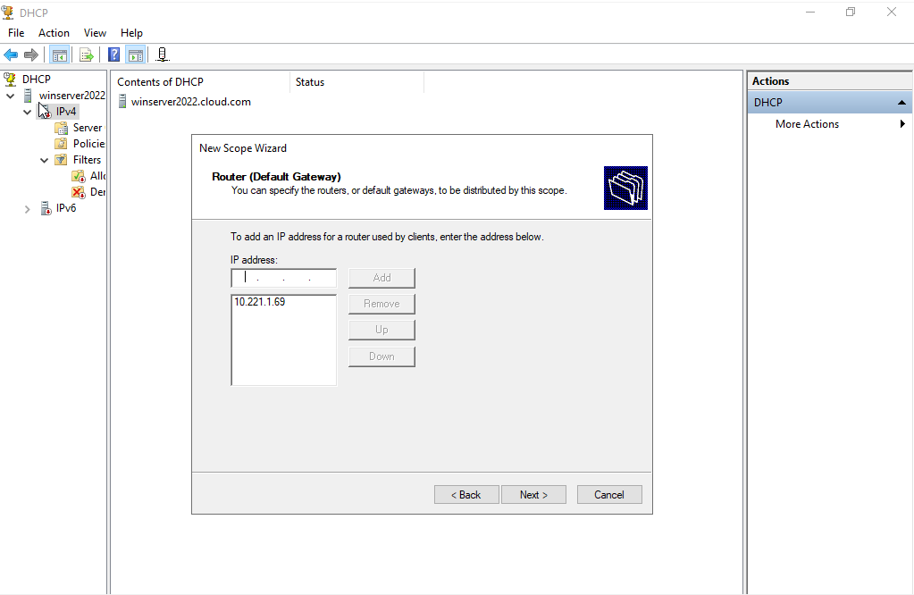
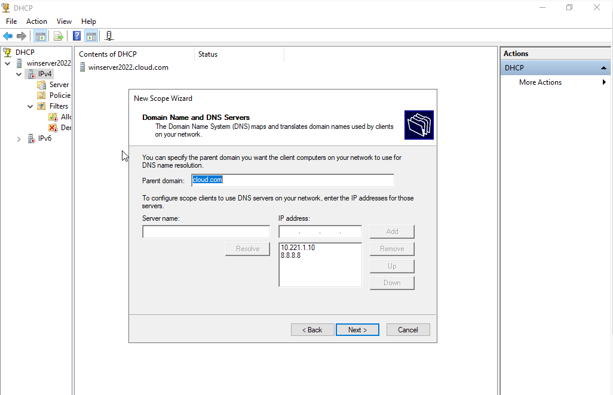
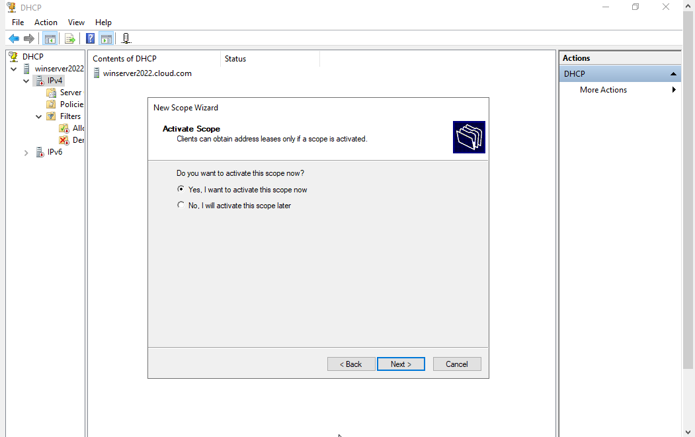
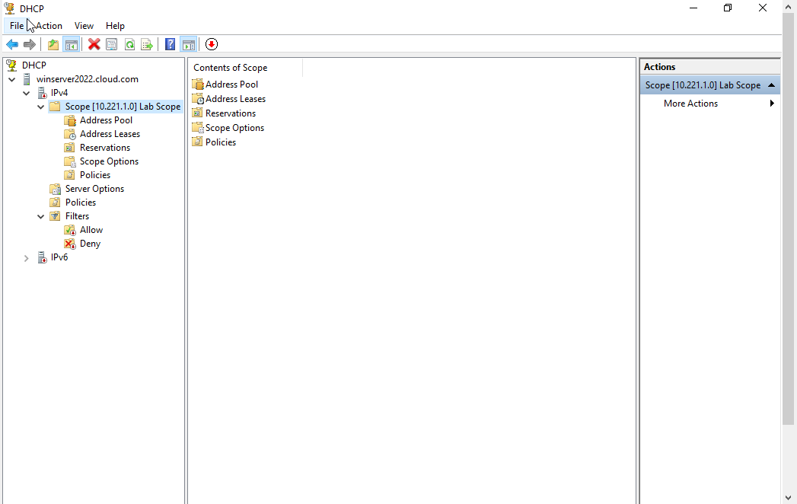

# 📡 DHCP-Configuration

## 📝 Overview

In this section of my Active Directory lab, I configured the **Dynamic Host Configuration Protocol (DHCP)** on **Windows Server 2022** to automatically assign IP addresses to domain-joined **Windows 10 clients**. Centralized DHCP management ensures reliable network communication, minimizes manual errors, and simplifies IP address allocation in enterprise environments.

---

## 🛠️ Configuration Steps

### 1. ⚙️ Install DHCP Server Role

I used **Server Manager** to install the **DHCP Server** role:

- Launched the **Add Roles and Features Wizard**
- Selected the role: `DHCP Server`
- Completed the wizard and confirmed the installation

📸 **DHCP Role Installation Summary**

---

### 2. ✅ Authorized the DHCP Server in Active Directory

After installation:

- Opened the **DHCP Console**
- Right-clicked the server name > `Authorize`
- Refreshed the console to confirm successful authorization

📸 **Authorized DHCP Server in DHCP Console**

---

### 3. 🌐 Created and Configure DHCP Scope

To distribute IP addresses to the Windows 10 clients:

- In the DHCP Console:
  - Right-clicked `IPv4` > `New Scope...`
  - Entered:
    - **Scope Name**: `Lab Scope`
    - **IP Range**: `10.221.1.100` to `10.221.1.200`
    - **Subnet Mask**: `255.255.255.0`
    - **Default Gateway**: `10.221.1.69`
    - **DNS Server**: Set to the domain controller’s IP `10.221.1.10`
- Activated the scope after configuration

📸 **DHCP Scope Name**

📸 **IP Address Range Configuration**

📸 **Lease Duration Configuration**

📸 **Configured DHCP Options**

📸 **Router (Default Gateaway) Configuration**

📸 **Domain Name and DNS Servers Settings**

📸 **Activated Scope Settings**

📸 **Configured DHCP Scope Settings Confirmation**

---

### 4. 🔍 Verify DHCP Client IP Allocation

On both Windows 10 clients:

- Set network adapters to obtain IP addresses automatically
- Ran `ipconfig /release` followed by `ipconfig /renew` from Command Prompt
- Verified that each client received an IP from the DHCP scope

---

### 5. 🔄 Confirm Leases in DHCP Console

Back on the DHCP server:

- Navigated to:
  `DHCP > IPv4 > Lab Scope > Address Leases`
- Verified both clients appeared with their assigned IP addresses and hostnames
- 
---

## ✍️ Summary

This DHCP configuration allows for seamless, automatic IP address management in the lab environment. By integrating DHCP with the domain setup, I enabled centralized control of network resources and reduced the risk of IP conflicts or manual misconfiguration.

**💼 Key skills demonstrated**

- Installing and authorizing the DHCP server role
- Creating and managing IP address scopes
- Verifying client DHCP leases
- Ensuring dynamic, domain-aware network configuration
