# 📜 Active Directory Certificate Services

## 📊 Overview

In this part of my Active Directory lab, I installed and configured **Active Directory Certificate Services (AD CS)** to establish a Public Key Infrastructure (PKI) within the domain. AD CS provides customizable services for issuing and managing public key certificates, which are used for securing information exchange through authentication, digital signatures, and encryption.

This setup laid the foundation for implementing advanced features like BitLocker recovery agents, secure email, and certificate-based authentication for users and devices across the domain.

---

## 🛠️ Configuration Steps

### 1. 🖥️ Add the AD CS Role

Using **Server Manager**, I added the **Active Directory Certificate Services** role on my domain controller.

- Role selected: `Active Directory Certificate Services`
- Services selected:
  - Certification Authority (CA)
  - Certification Authority Web Enrollment

📸 **Server Role Selection**

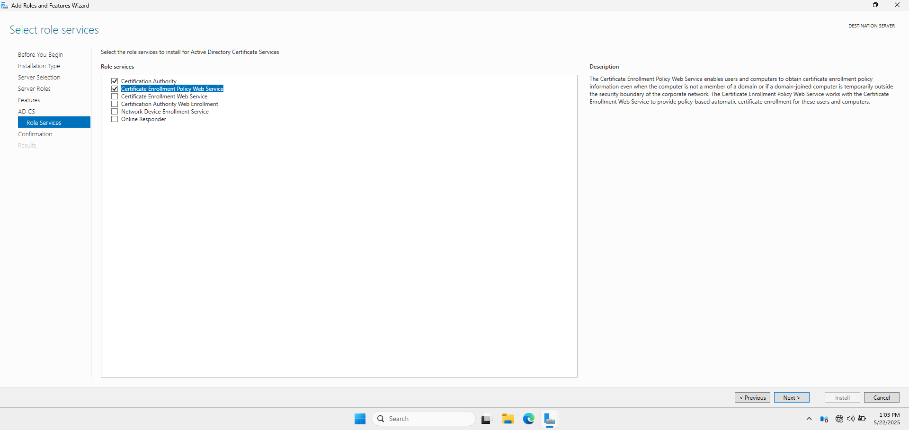

---

### 2. 📡 Configure AD CS Role Services

After the role installation, I launched the **AD CS Configuration Wizard** to set up the CA:

- **Role services configured**:
  - Certification Authority
  - Certification Authority Web Enrollment
- **Setup type**: Enterprise CA
- **CA type**: Root CA
- **Private key**: Created a new private key
- **Cryptography settings**: RSA 2048-bit
- **CA name**: Auto-generated using domain and hostname
- **Validity period**: 10 years
- **Certificate database locations**: Used default paths

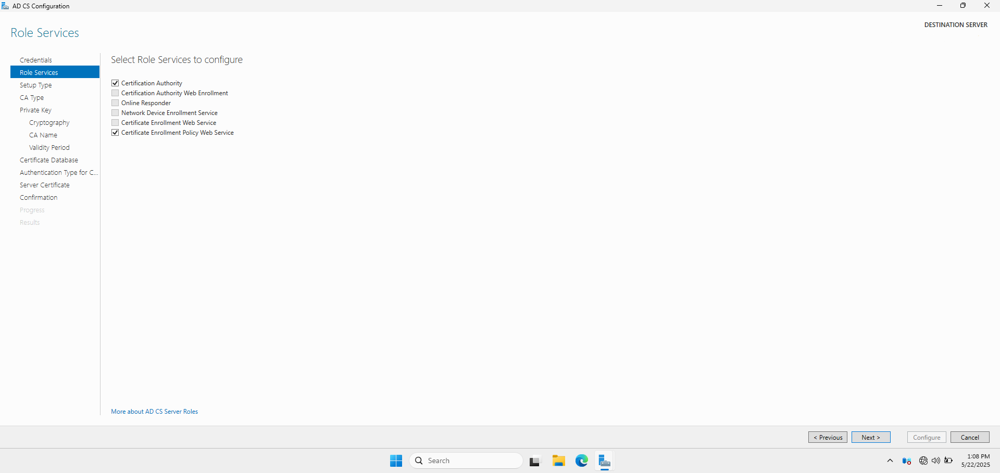

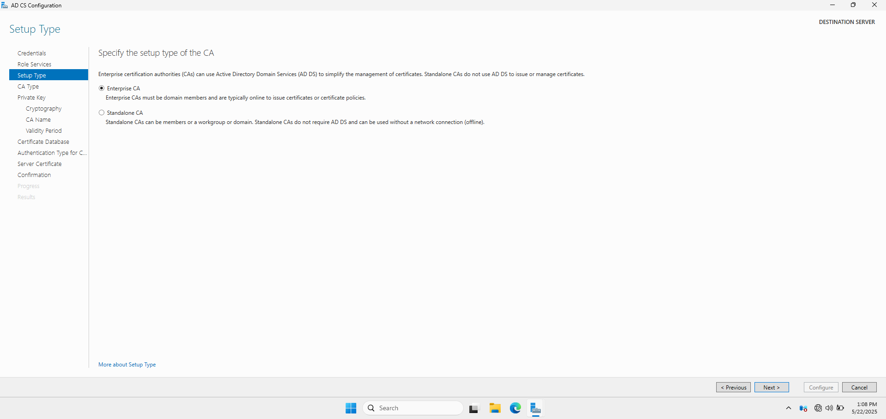

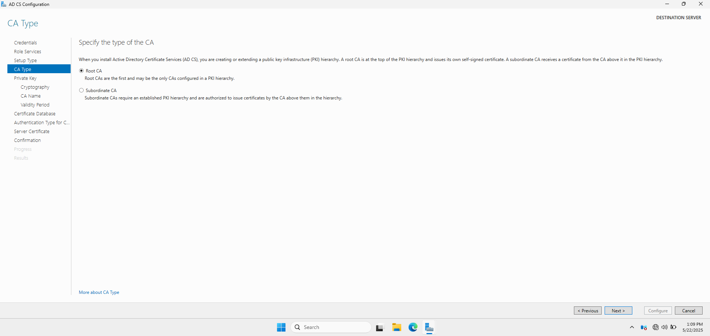

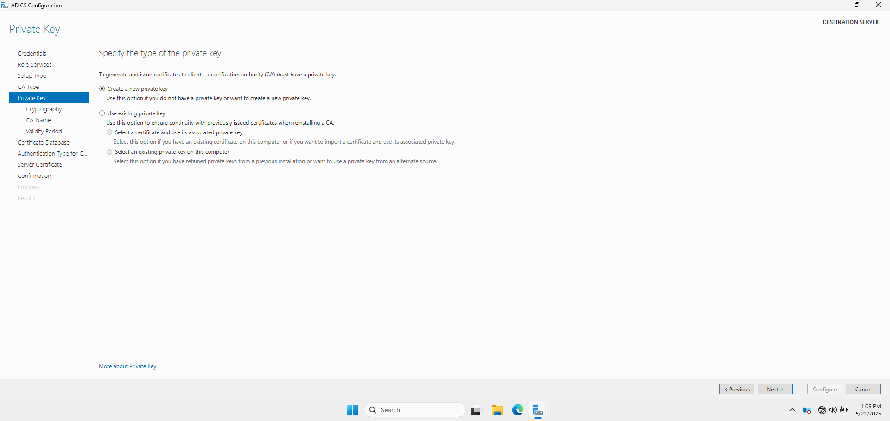

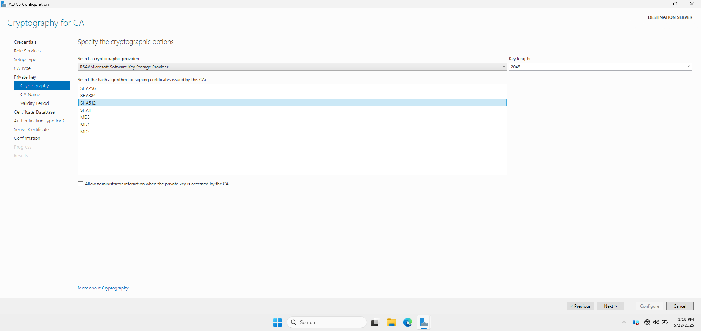

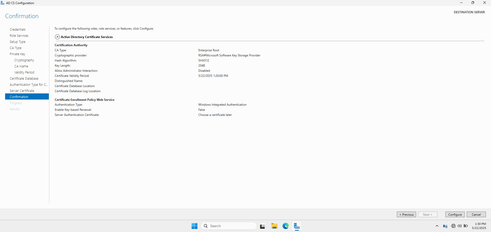

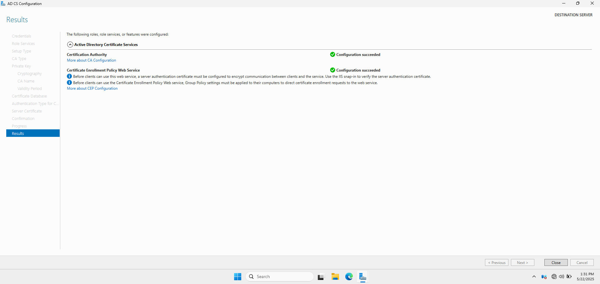

---

### 3. 🔍 Verify Certification Authority Installation

After completing the wizard, I verified the CA installation via:

- The **Certification Authority console** (`certsrv.msc`)
- Confirmed the root certificate was issued
- Checked Event Viewer logs for successful startup

---

### 4. 🌐 Publish the Root Certificate

To ensure domain clients trust the internal CA, I:

- Opened **Group Policy Management**
- Navigated to:  

📂 `Computer Configuration → Policies → Windows Settings → Security Settings → Public Key Policies → Trusted Root Certification Authorities`

- Imported the Root CA certificate
- Forced Group Policy update using `gpupdate /force` on client machines

📸 **Root CA GPO Configuration**

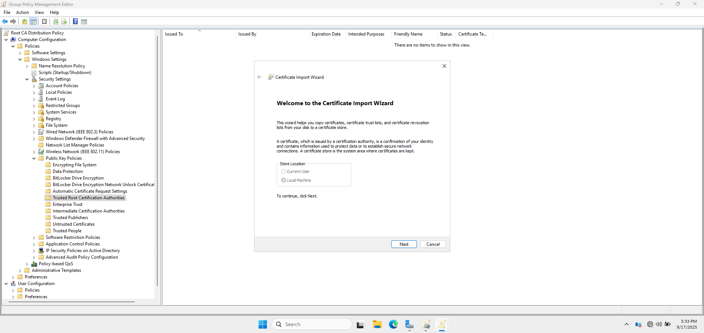

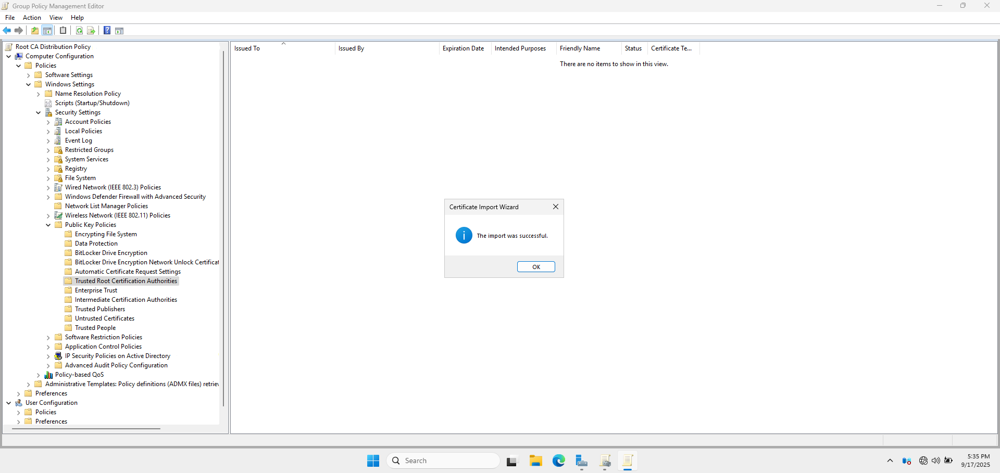

---

### 5. 📥 Install Web Enrollment

After publishing the Root CA certificate via Group Policy, I verified that the **Certificate Authority Web Enrollment** portal was accessible from both the server and domain-joined clients. Access was successful using the FQDN 

---

## Summary

By installing and configuring AD CS, I established a foundational internal PKI within my Active Directory lab. This service enables secure identity verification and supports various enterprise features such as BitLocker encryption, S/MIME, and certificate-based authentication. The configuration of the CA, key parameters, and trust distribution showcases my ability to manage core security infrastructure in a Windows Server environment.

📸 **CA Root Certificate Installed on `AD-WIN10-01`**

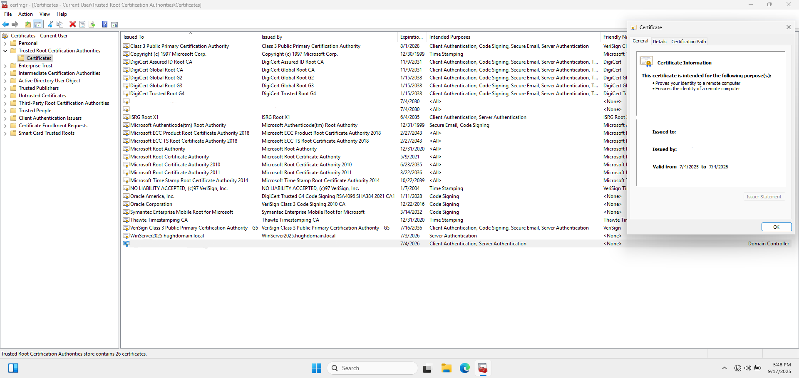

📸 **CA Root Certificate Installed on `AD-WIN10-02`**

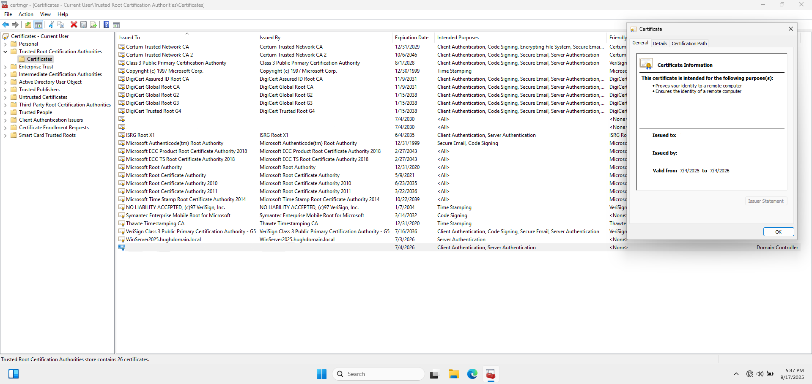

