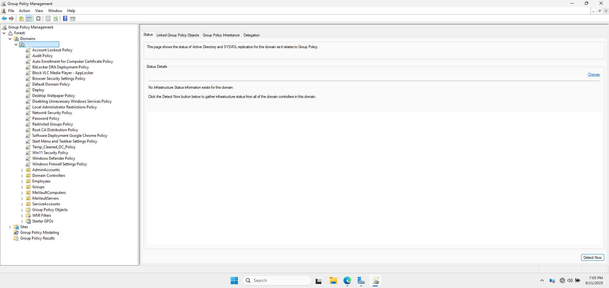
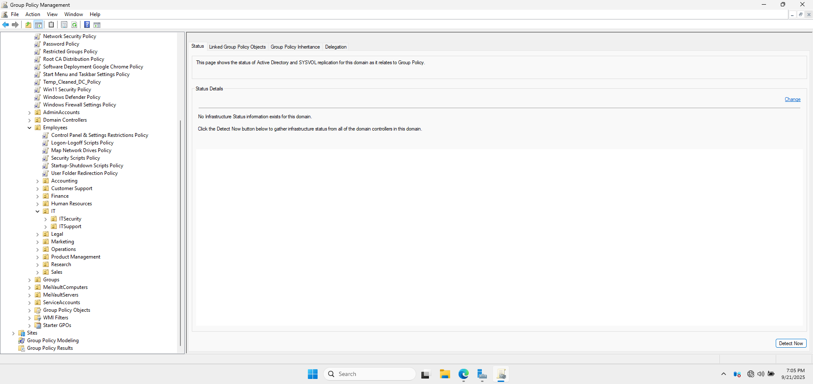
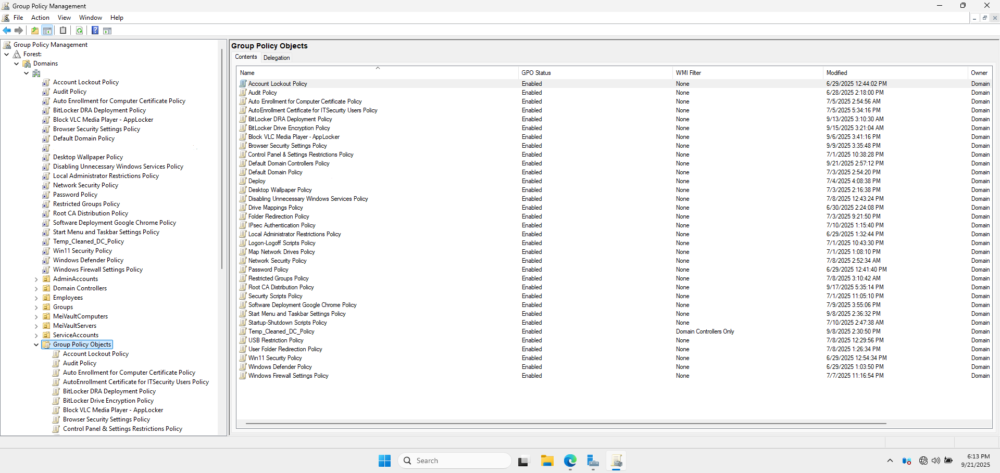
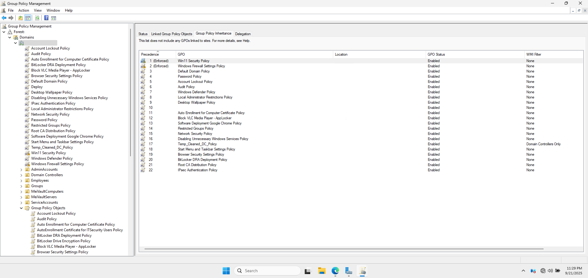
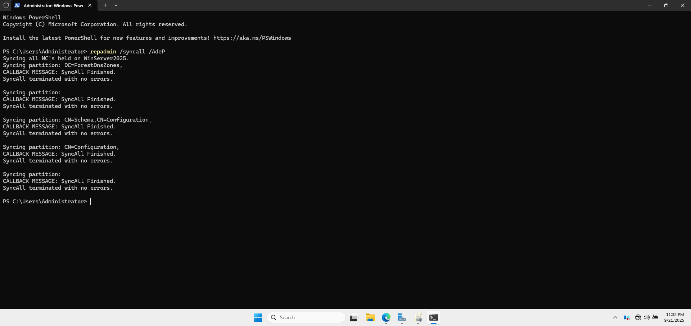
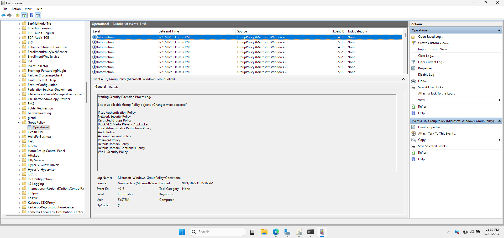
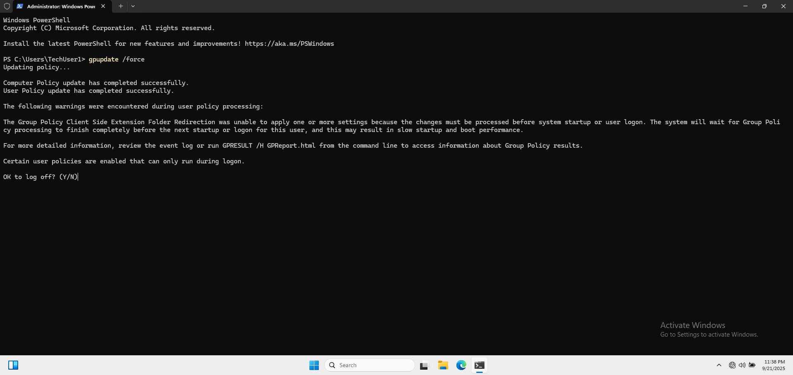

# 🔧 Group Policy Configuration

This document outlines the key **Group Policy Objects (GPOs)** I created and linked to the domain to enforce security, user restrictions, and environment settings. These policies are critical for central management and enforcing compliance in a Windows enterprise environment.

---

## 🧱 1. Organizational Unit (OU) Structure

Before creating GPOs, I organized domain objects into appropriate **Organizational Units** for better control and delegation.

### OU Structure:
- `Domains`
  - `cloud.com`
- `AdminAccounts`
- `Domain Controllers`
- `Employees`
  - `Accounting`
  - `Customer Support`
  - `Finance`
  - `Human Resources`
  - `IT`
    - `ITSecurity`
    - `ITSupport` 
  - `Legal`
  - `Marketing`
  - `Operations`
  - `Product Management`
  - `Research`
  - `Sales`
- `Groups`
- `MeiVaultComputers`
- `MeiVaultServers`
- `ServiceAccounts`
- `Users`

📸 **Active Directory Users and Computers (ADUC) Showing OU Hierarchy**





---

## ⚙️ 2. GPO Creation and Linking

Created and linked GPOs to the appropriate OUs using the **Group Policy Management Console (GPMC)**.

### GPOs Implemented:
| GPO Name                                                 | Linked To          | Purpose                                                                    |
|----------------------------------------------------------|--------------------|----------------------------------------------------------------------------|
| Account Lockout Policy                                   | Domain Root           | Mitigates brute-force password attacks by locking accounts after a specified number of failed login attempts, protecting against unauthorized access                                                             |
| Audit Policy                                             | Domain Root           | Tracks and logs specific user and system activities (e.g., logon/logoff, file access, policy changes) for security monitoring, forensic analysis, and compliance                                                |
| Auto Enrollment for Computer Certificate Policy          | Domain Root           | Automatically issues and manages digital certificates for domain-joined computers, enabling seamless use of technologies like IPsec, EFS, and wireless authentication                                        |
| Auto Enrollment Certificate for ITSecurity Users Policy  | ITSecurity OU         | Automatically issues specific digital certificates to members of the ITSecurity group, enabling secure authentication, email signing, and encryption for privileged users                                        |
| BitLocker DRA Deployment Policy                          | Domain Root           | Ensures that a Data Recovery Agent (DRA) certificate is backed up in Active Directory, allowing authorized IT personnel to recover data from BitLocker-encrypted drives if a password is lost or a user leaves   |
| BitLocker Encryption Policy                              | MeiVaultComputers     | Enforces full-disk encryption using BitLocker to protect data at rest   |
| Block VLC Media Player - AppLocker                       | Domain Root           | Prevent the use of unauthorized media applications                      |
| Browser Security Settings Policy                         | Domain Root           | Configure Microsoft Edge settings to enhance browser security           |
| Control Panel & Settings Restrictions Policy             | Employees OU          | Limit user access to control panel settings                             |
| Default Domain Controller Policy                         | Domain Controllers    | Contains default critical authentication settings for the domain. It is modified to strengthen security policies (like Kerberos) specifically for domain controllers                                          |
| Default Domain Policy                                    | Domain Root           | Contains default settings for all users and computers in the domain. It is modified to establish baseline security settings, such as password policies, that apply domain-wide                                   |
| Deploy HughDomain-WinServer2025 Certificate Policy       | Domain Root           | Deploys a specific trusted root or intermediate certificate authority certificate to all domain members, ensuring they trust services and applications signed by this CA                                           |
| Desktop Wallpaper Policy                                 | Domain Root           | Standardize desktop appearance across all user devices                  |
| Disabling Unnecessary Windows Services Policy            | Domain Root           | Reduce attack surface by disabling non-essential services               |
| Drive Mappings Policy                                    | ITSecurity OU         | Assign network drives based on user or group membership                 |
| Folder Redirection Policy                                | ITSecurity OU         | Redirects the contents of key user folders (e.g., Documents, Desktop) from the local computer to a network share, ensuring data is centrally stored and backed up                                              |
| IPsec Authentication Policy                              | Domain Root           | Enforce secure communication through IPsec authentication               |
| Local Administrator Restrictions Policy                  | Employees OU          | Prevents standard user accounts from being added to the local administrators group on workstations, adhering to the principle of least privilege and reducing malware impact.                                   |
| Logon-Logoff Scripts Policy                              | Employees OU          | Run custom scripts during user logon and logoff events                  |
| Map Network Drives Policy                                | Employees OU          | Automatically connect users to shared network resources                 |
| Network Security Settings Policy                         | Domain Root           | Configures protocols like NTLM, LDAP, and SMB to use stronger security features (e.g., LDAP signing, SMB encryption) to protect network traffic from interception and relay attacks                              |
| Password Policy                                          | Domain Root           | Defines requirements for user password complexity, length, age, and history to enforce strong authentication credentials and protect against password guessing.                                                  |
| Restricted Groups Policy                                 | Domain Root           | Define and enforce group membership for privileged roles                |
| Root CA Distribution Policy                              | Domain Root           | Uses Group Policy to automatically install the organization's trusted Root Certificate Authority certificate onto all domain-joined machines, ensuring they trust internally issued certificates                 |
| Security Scripts Policy                                  | Employees OU          | 	Executes custom scripts (e.g., for environment configuration, security checks, or compliance reporting) on user workstations to enforce security posture and operational standards                          |
| Software Deployment Google Chrome Policy                 | Domain Root           | Automate installation of approved web browser software                  |
| Start Menu and Taskbar Settings Policy                   | Domain Root           | Customize user interface elements for consistency and control           |
| Startup/Shutdown Scripts Policy                          | Employees OU          | Execute scripts during system startup and shutdown events               |
| Temp_Cleaned_DC_Policy                                   | Domain Controllers    | Clears temporary files and caches on Domain Controllers                 |
| USB Restriction Policy                                   | MeiVaultComputers OU  | Block the use of USB storage devices to prevent data leakage            |
| User Folder Redirection Policy                           | Employees OU          | Redirect user data folders to centralized file servers                  |
| Win11 Security Policy                                    | Domain Root           | Apply Windows 11-specific hardening configurations                      |
| Windows Defender Settings Policy                         | Domain Root           | Configure antivirus settings for enhanced endpoint protection           |
| Windows Firewall Settings Policy                         | Domain Root           | Enforce firewall rules to control inbound and outbound traffic          |

📸 **GPMC with List of GPOs**



---

## 🔁 3. GPO Enforcement & Inheritance

- Used **Enforced** flag for domain-wide security GPOs.
- Blocked inheritance on specific OUs where necessary to prevent unintended policy application.

📸 **GPMC Showing GPO Inheritance Settings**



---

## 📤 4. GPO Replication Verification

Verified that GPOs were successfully replicated and applied:

### On Domain Controller:
- Checked Event Viewer for GroupPolicy logs under:<br />
📂 `Applications and Services Logs > Microsoft > Windows > GroupPolicy`.
- Ran:
```powershell
repadmin /syncall /AdeP
```

📸 **Command Line Results from `Repadmin Syncall AdeP`**



📸 **Event Viewer Logs Confirming GPO application**



### On Clients:
- Ran `gpupdate /force`
- Ran `gpresult /r`

📸 **Command Line Results from `gpupdate` on `AD-WIN10-01`**



