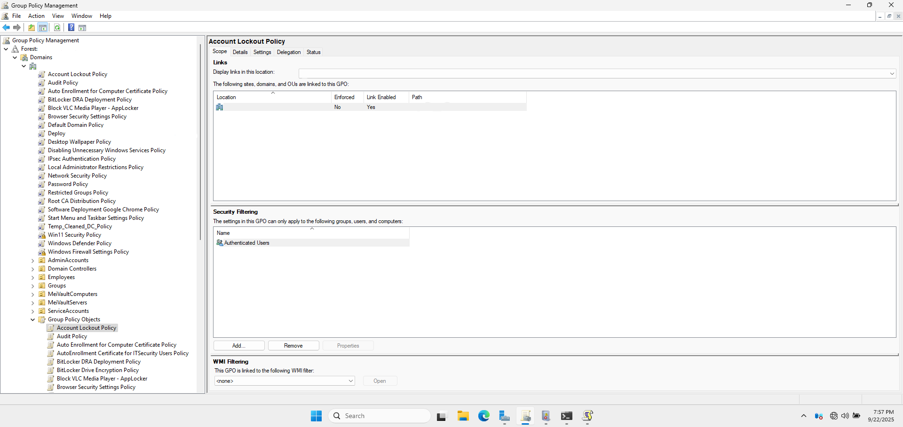
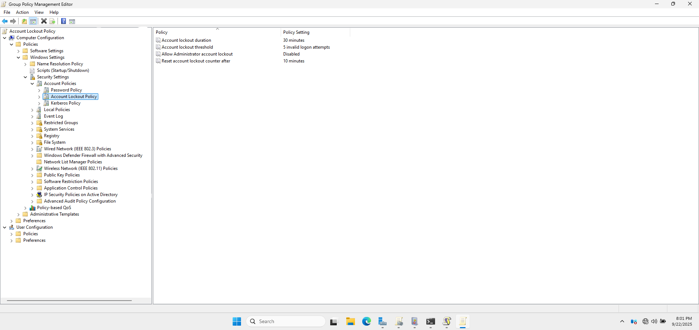
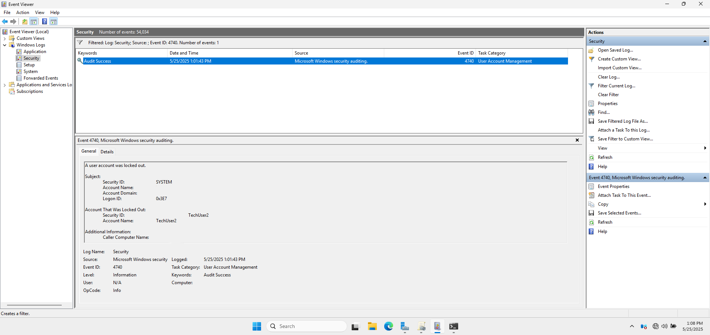
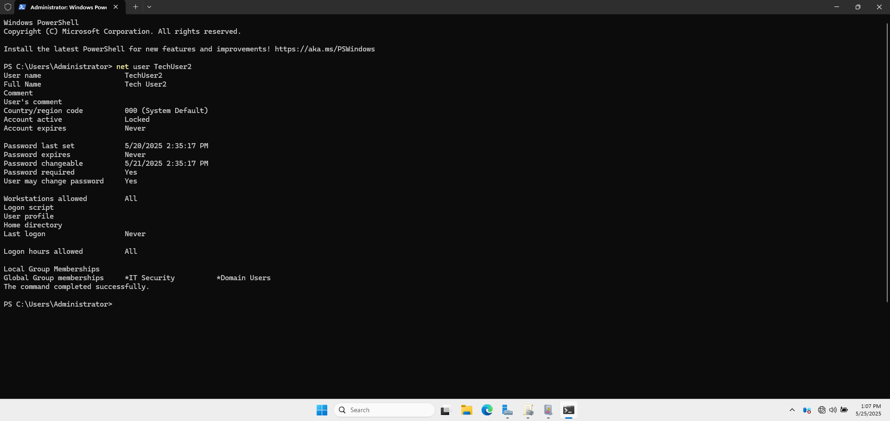

# 🚫 Account Lockout Policy (Domain GPO)

This document outlines the **Account Lockout Policy** configured in the domain to limit repeated invalid login attempts. This policy adds a critical layer of defense against password-guessing and brute-force attacks.

---

## 📛 1. GPO Name

- **GPO Name:** Account Lockout Policy  
- **Linked to:** cloud.com (domain root)

Created and applied via the **Group Policy Management Console (GPMC)**, this GPO was designed to lock accounts temporarily after multiple failed login attempts.

📸 **GPMC Showing the Account Lockout Policy GPO and its Link to the Domain**

---

## ⚙️ 2. Policy Settings

Configured in: 
  📂 `Computer Configuration > Policies > Windows Settings > Security Settings > Account Policies > Account Lockout Policy`

| Setting                                     | Value         |
|---------------------------------------------|---------------|
| **Account lockout duration**                | 30 minutes    |
| **Account lockout threshold**               | 5 attempts    |
| **Allow Administrator account lockout**     | Disabled      |
| **Reset account lockout counter after**     | 10 minutes    |

These settings ensure that accounts are temporarily disabled after five failed logon attempts, making it more difficult for attackers to guess passwords.

📸 **Group Policy Editor Window Showing the Account Lockout Policy Settings**

---

## 📌 3. Purpose and Justification

### 🔐 Why These Settings?

- **Lockout threshold** protects against brute-force attacks by blocking accounts after several failed attempts.
- **Lockout duration** gives time for security teams to investigate.
- **Reset counter** balances usability and protection by allowing recovery after inactivity.

These configurations align with enterprise security policies and common audit standards.

---

## ✅ 4. Testing and Validation

- Simulated five incorrect logins on a test account.
- Verified the account was locked.
- Checked Event Viewer logs for lockout entries under: 
  📂 `Event Viewer > Windows Logs > Security`

- Used `net user TechUser2` to confirm lockout status.

📸 **User Account Management Account Lockout**

📸 **Command Prompt Showing Account Status After Lockout**

📸 **`AD-WIN10-01` Showing Account Lockout Policy Successfully Implemented for `TechUser2`**

