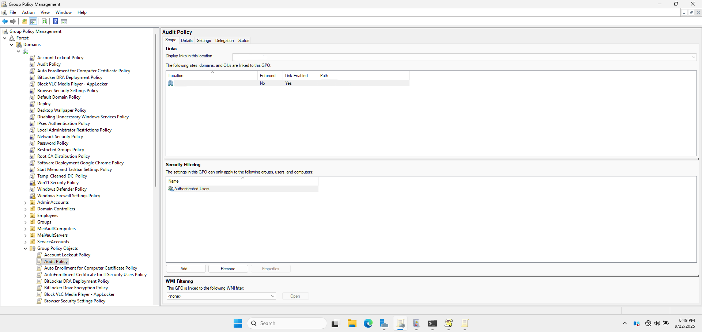
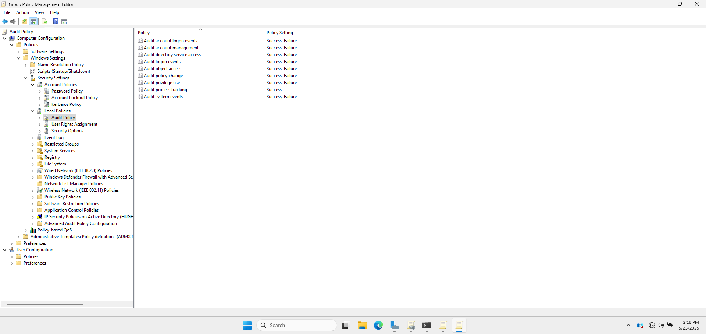
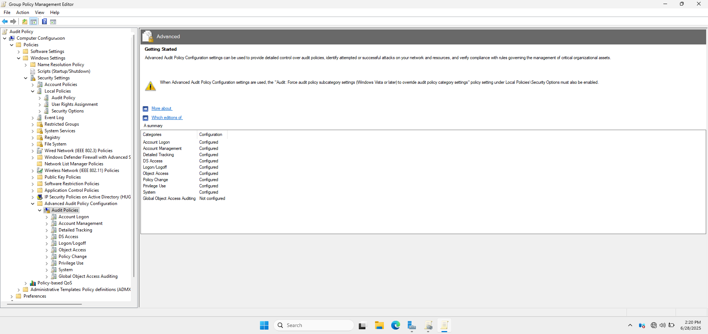
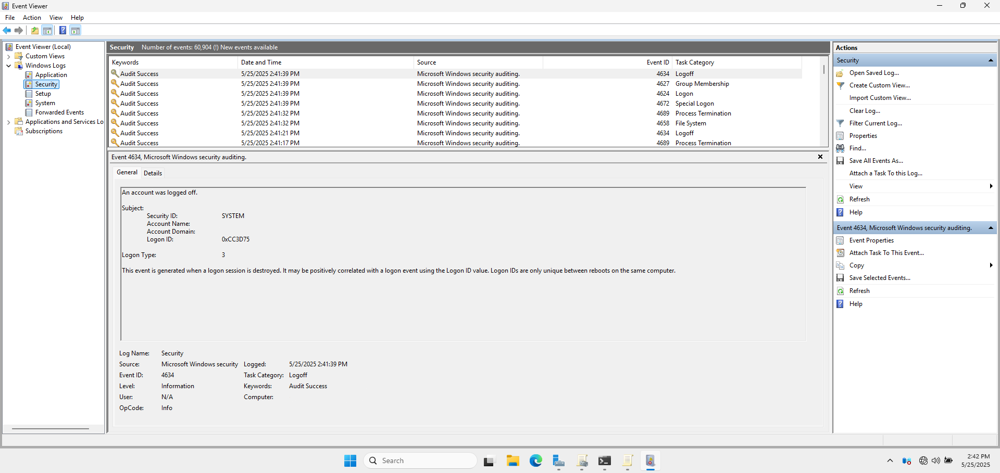
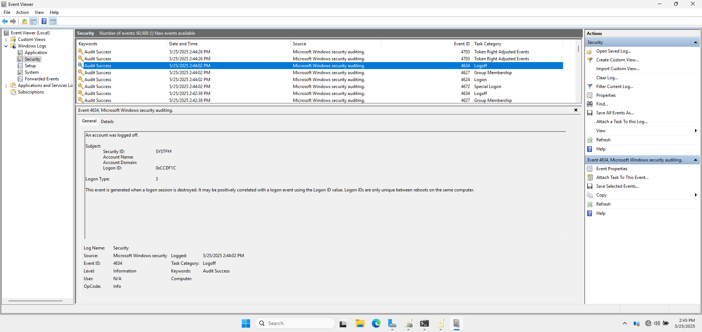
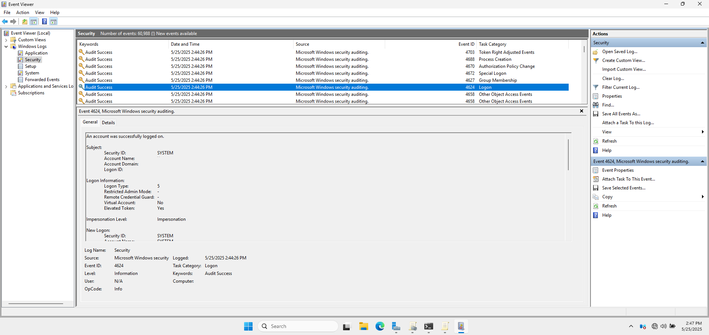
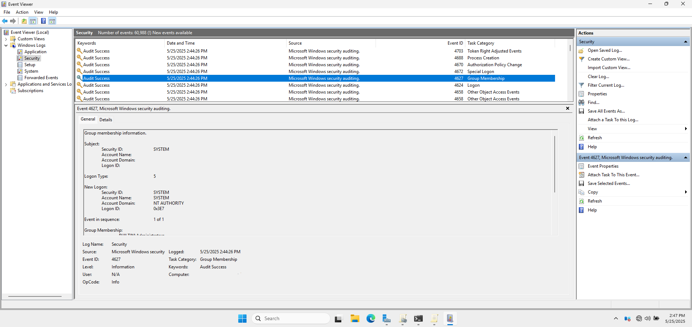
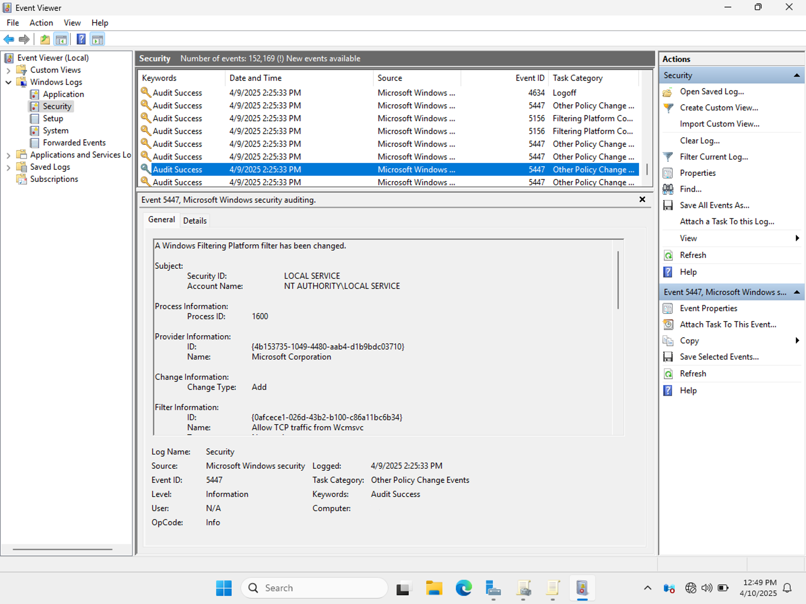
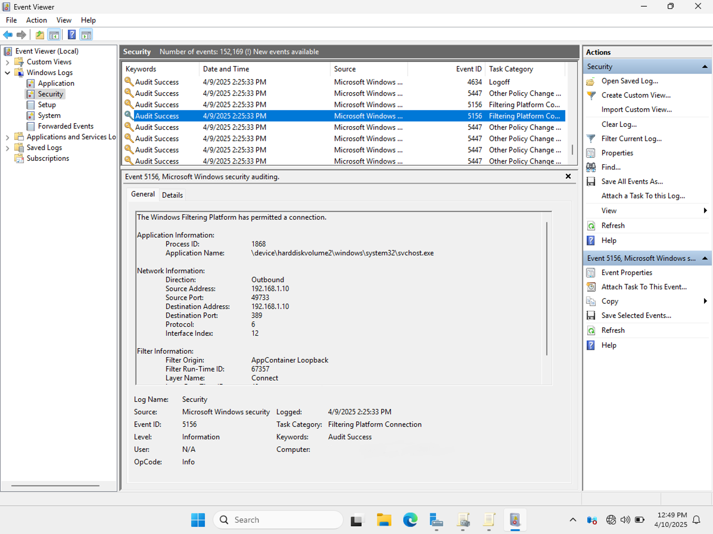

# 🔍 Audit Policy (Domain GPO)

This document outlines the **Audit Policy** applied to the domain via Group Policy. Audit policies help monitor authentication, privilege use, and changes to critical objects in Active Directory, aiding in both proactive security and incident response.

---

## 🏷️ 1. GPO Name

- **GPO Name:** Audit Policy  
- **Linked To:** cloud.com (domain root)

Created using the **Group Policy Management Console (GPMC)**, this GPO was applied at the domain level to ensure consistent audit logging across all domain-joined systems.

📸 **GPMC Showing the Linked Domain Audit Policy GPO**

---

## ⚙️ 2. Policy Settings

Path to settings:   
  📂 `Computer Configuration > Policies > Windows Settings > Security Settings > Advanced Audit Policy Configuration > Audit Policies`

| Category               | Setting                          | Audit Type        |
|------------------------|----------------------------------|-------------------|
| **Account Logon**      | Credential Validation            | Success/Failure   |
| **Account Management** | User Account Management          | Success/Failure   |
| **Detailed Tracking**  | Process Creation                 | Success           |
| **Logon/Logoff**       | Logon Events                     | Success/Failure   |
| **Object Access**      | File System Access               | Success/Failure   |
| **Policy Change**      | Audit Policy Changes             | Success/Failure   |
| **Privilege Use**      | Sensitive Privilege Use          | Success/Failure   |
| **System**             | Security System Extension        | Success/Failure   |

📸 **Group Policy Editor Window Showing the Audit Policy Configuration Window**

📸 **Advanced Audit Policy Configuration Window**

---

## 🛡️ 3. Purpose and Justification

Audit policies provide visibility into actions that may indicate unauthorized behavior. These logs are essential for:

- **Compliance** with standards like ISO 27001, NIST 800-53, and CIS Controls.
- **Forensics** in the event of an incident or breach.
- **Alerting** through SIEM tools or manual log reviews.

By auditing both successful and failed events, I ensured I could track both normal user activity and suspicious behavior.

---

## 🔎 4. Testing and Verification

- Performed logon attempts, privilege use, and file access actions.

- Opened **Event Viewer** on the domain controller: 
  📂 `Event Viewer > Windows Logs > Security`
  
- Verified audit entries matched the expected activities.

📸 **Security Event Logs in Event Viewer Showing Sample Audited Events**

📸 **Other Policy Change Events**

📸 **Logoff**

📸 **Logon**

📸 **Group Membership**

📸 **Special Logon**

