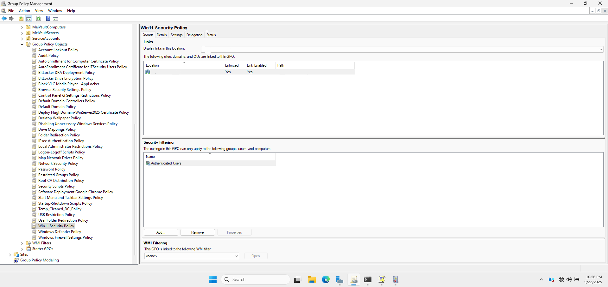
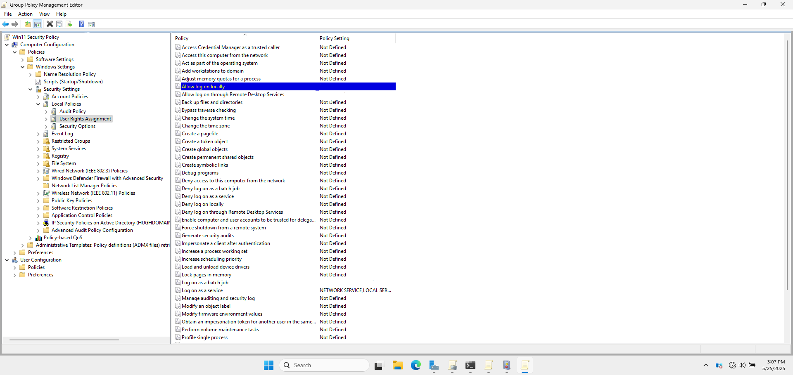
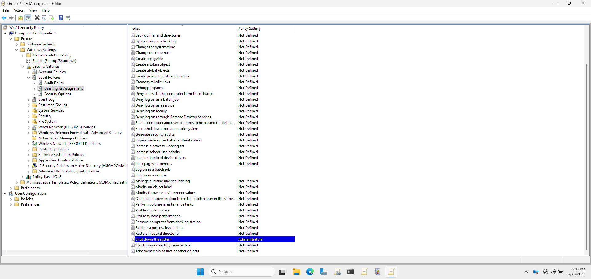
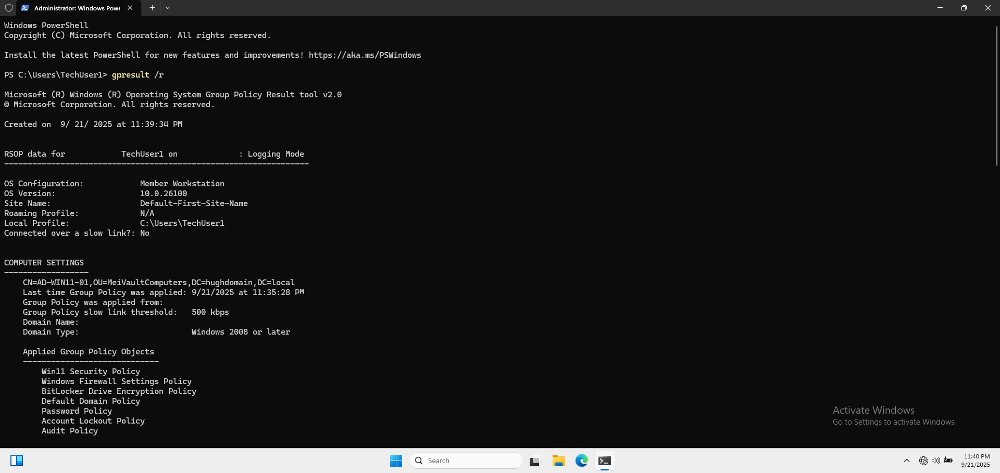
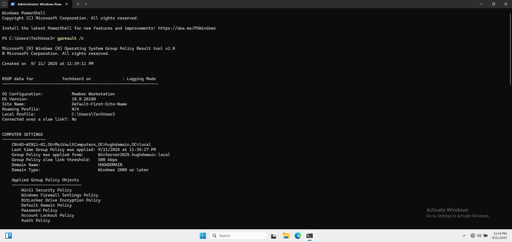

# 👤 User Rights Assignment (Domain GPO)

This section documents the **User Rights Assignment** configured through Group Policy to define and manage the specific rights assigned to users and groups in the domain.

---

## 📛 1. GPO Name

- **GPO Name:** Win10 Security Policy
- **Linked To:** cloud.com (domain root)

This policy is configured using the **Group Policy Management Console (GPMC)** and applied at the domain level to ensure that all user rights are properly assigned.

📸 **GPMC Showing User Rights Assignment GPO Under Win11 Security Policy**



---

## ⚙️ 2. Policy Settings

The following settings were configured under:<br />
    📂 `Computer Configuration > Policies > Windows Settings > Security Settings > Local Policies > User Rights Assignment`

| Setting                                                            | Value                           |
|--------------------------------------------------------------------|---------------------------------|
| **Allow Log on locally**                                           | Administrators, Domain Users    |
| **Allow Log on through Remote Desktop Services**                   | Administrators, Domain Users    |
| **Log on as a service**                                            | Local Service, Network Service  |
| **Log on as a batch job**                                          | Administrators, Backup Admins   |
| **Shut down the system**                                           | Administrators                  |

These rights control the ability of users or groups to log on to the system, run services, and perform administrative tasks like shutting down the computer.

📸 **Group Policy Editor Window Showing User Rights Path**





---

## 📌 3. Purpose and Justification

### 🛡️ Why These Settings?

- **Log on locally** allows users to log into the local machine.
- **Log on as a service** grants specific system accounts the ability to run services.
- **Log on as a batch job** allows the user to execute batch scripts.
- **Shut down the system** restricts this action to administrators to avoid unintentional shutdowns by non-privileged users.

---

## ✅ 4. Testing and Validation

- Tested by attempting to log in with different user accounts to validate the policy application.
- Verified user rights using:

```powershell
gpresult /r
```

📸 **Command Line Results from `gpresult` on `AD-WIN10-01`**




📸 **Command Line Results from `gpresult` on `AD-WIN10-02`**


