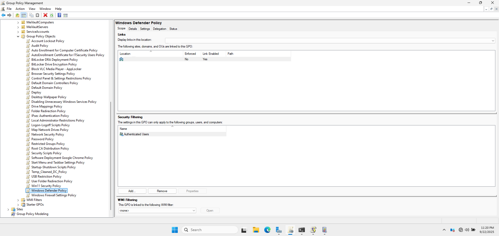
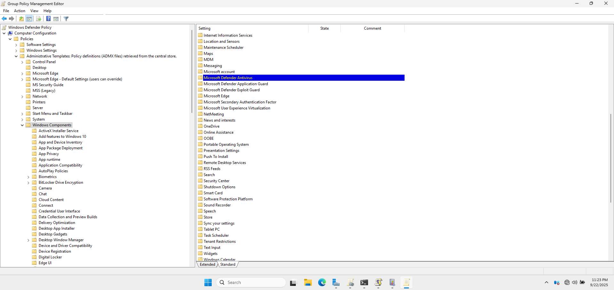
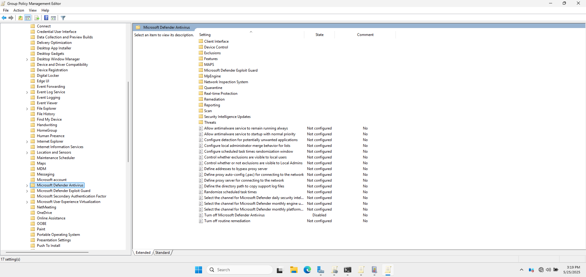
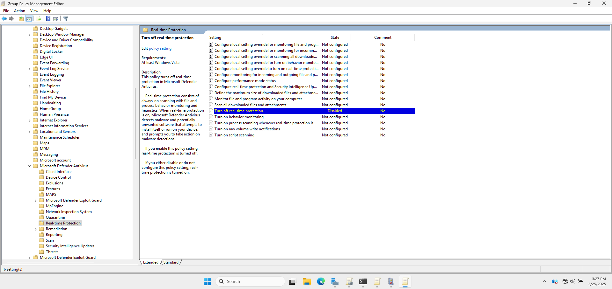
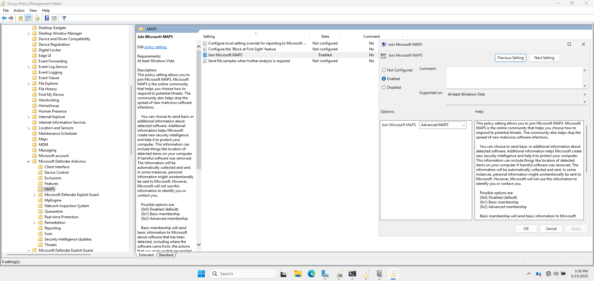
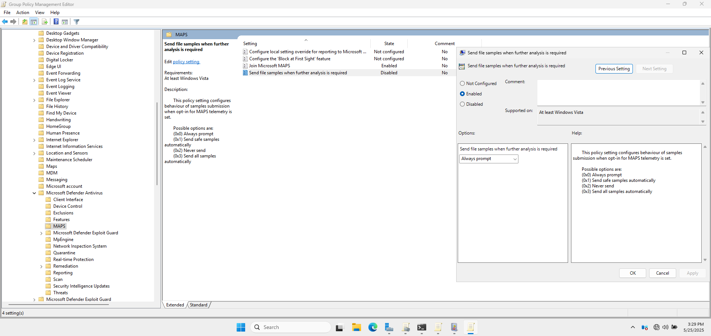
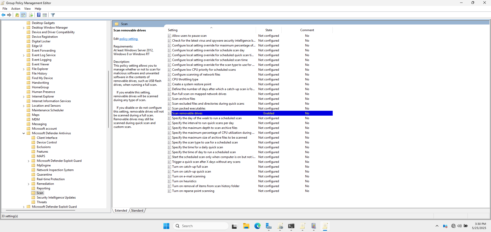
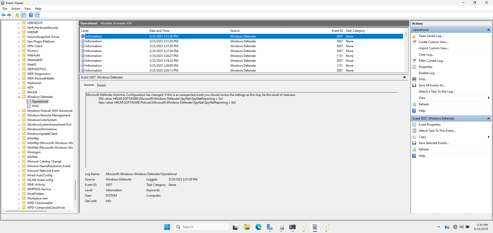

# 🛡️ Windows Defender Policies (Domain GPO)

This section describes the **Windows Defender Policies** implemented via Group Policy to secure client machines and enforce antivirus protections.

---

## 📛 1. GPO Name

- **GPO Name:** Windows Defender Policy
- **Linked To:** cloud.com (domain root)

This policy is configured using the **Group Policy Management Console (GPMC)** and applied at the domain level for all domain-joined computers.

📸 **GPMC Showing Windows Defender GPO**

---

## ⚙️ 2. Policy Settings

Configured under: 
📂 `Computer Configuration > Policies > Administrative Templates > Windows Components > Microsoft Defender Antivirus`

| Setting                                                 | Value                |
|---------------------------------------------------------|----------------------|
| **Turn off Microsoft Defender Antivirus**               | Disabled             |
| **Turn off real-time protection**                       | Disabled             |
| **Join Microsoft MAPS**                                 | Enabled              |
| **Scan Removable Drives**                               | Enabled              |
| **Send file samples when further analysis is required** | Enabled              |

These settings ensure that Windows Defender is active, real-time protection is enabled, and cloud-based protections are being used.

📸 **Group Policy Editor Window Showing Windows Defender Path**

---

## 📌 3. Purpose and Justification

### 🛡️ Why These Settings?

- **Turn off Microsoft Defender Antivirus** ensures the system is protected against malware and other threats.
- **Turn off real-time protection** provides immediate scanning of files and processes.
- **Join Microsoft MAPS** enhances threat detection with Microsoft's cloud-based security.
- **Send file samples when further analysis is required** allows Windows Defender to send suspicious files to Microsoft for analysis.
- **Scan Removable Drives**  ensures that when USB drives, external hard disks, and other removable storage are connected to the system, they are automatically scanned for malware before users can access their contents. This prevents malicious software from spreading through removable media, which is a common attack vector in environments where users frequently share files via external drives.

📸 **Turn off Microsoft Defender Antivirus**

📸 **Turn Off Real-time Protection**

📸 **Join Microsoft MAPS**

📸 **Send File Samples when Further Analysis is Required**

📸 **Scan Removable Drives**

---

## ✅ 4. Testing and Validation

- Verified Windows Defender status on client machines.
- Ran sample malware tests to ensure real-time protection is active.
- Checked logs for submitted sample files.

📸 **Event Viewer Showing Windows Defender Logs**

