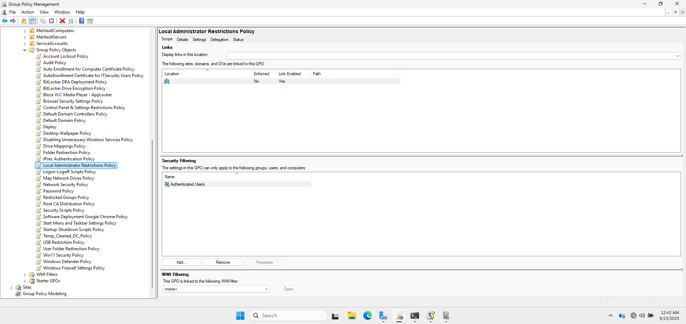
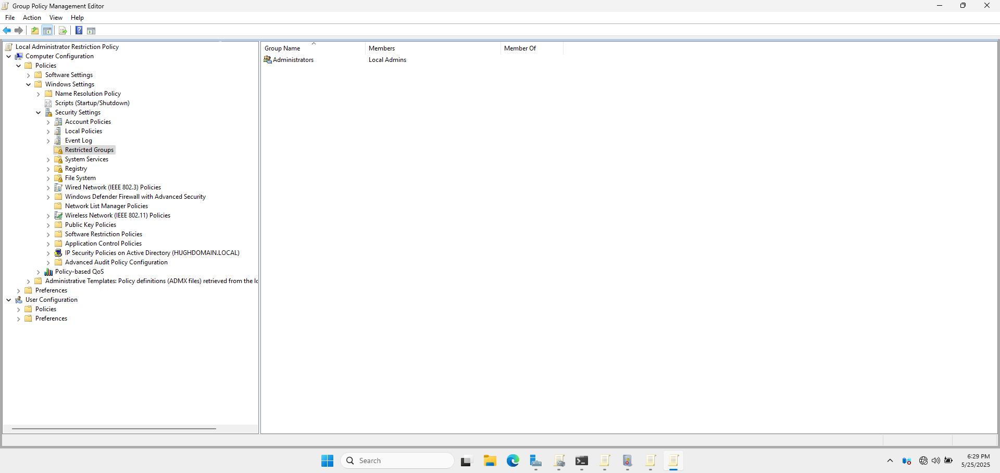
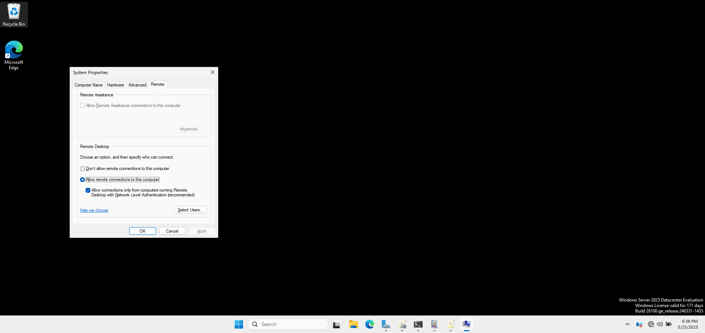
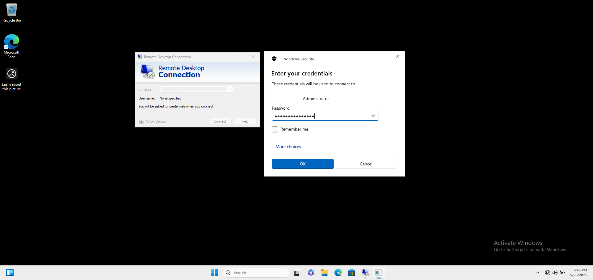
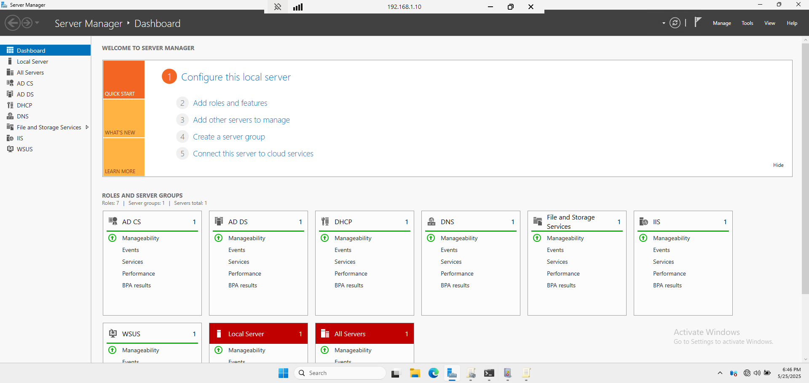

# 👨‍💻 Local Administrator Restrictions

This section outlines the **Local Administrator Restrictions** to limit access and control for local administrators across all machines in the domain.

---

## 📛 1. GPO Name

- **GPO Name:** Local Administrator Restrictions Policy
- **Linked To:** cloud.com (domain root)

This policy is configured using the **Group Policy Management Console (GPMC)** and applied at the domain level.

📸 **GPMC Showing Local Administrator Restrictions GPO**

---

## ⚙️ 2. Policy Settings

Configured under: 
  📂 `Computer Configuration > Policies > Windows Settings > Security Settings > Restricted Groups`

| Setting                                                       | Value                       |
|---------------------------------------------------------------|-----------------------------|
| **Administrators**                                            | Domain Admins, Local Admins |
| **Deny Local Administrators from Remotely Accessing Systems** | Enabled                     |

These settings restrict local administrators from accessing systems remotely and enforce the use of domain-based administrative rights.

📸 **Group Policy Editor Window Showing Local Administrator Restrictions Path**

---

## 📌 3. Purpose and Justification

### 🛡️ Why These Settings?

- **Restricting local administrator access** reduces the possibility of unauthorized access to sensitive systems.
- **Denying remote access** ensures that administrators cannot connect remotely without proper authorization.

---

## ✅ 4. Testing and Validation

- Tested remote access restrictions by attempting to log in with local administrator credentials.
- Verified that only domain admins had the ability to perform administrative tasks.

📸 **Remote Desktop RDP Enabled on Server for `WinServer2022`**

📸 **Remote Desktop Access with Domain Admin Credentials Showing Test Success

