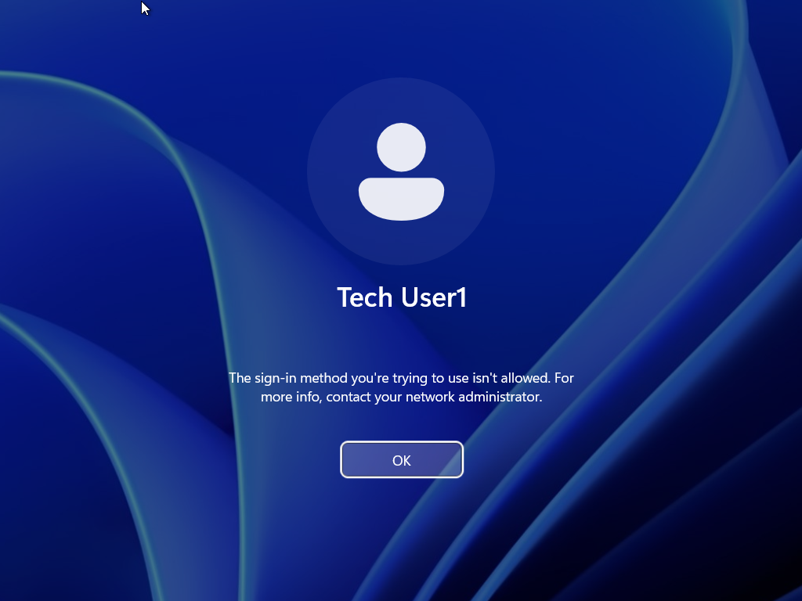
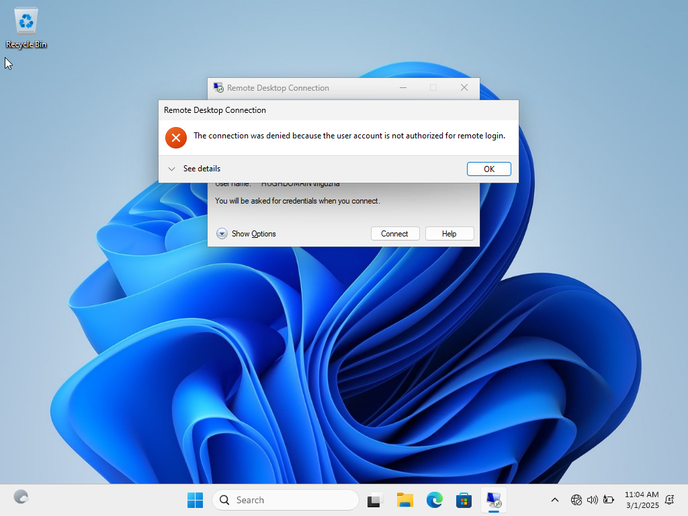
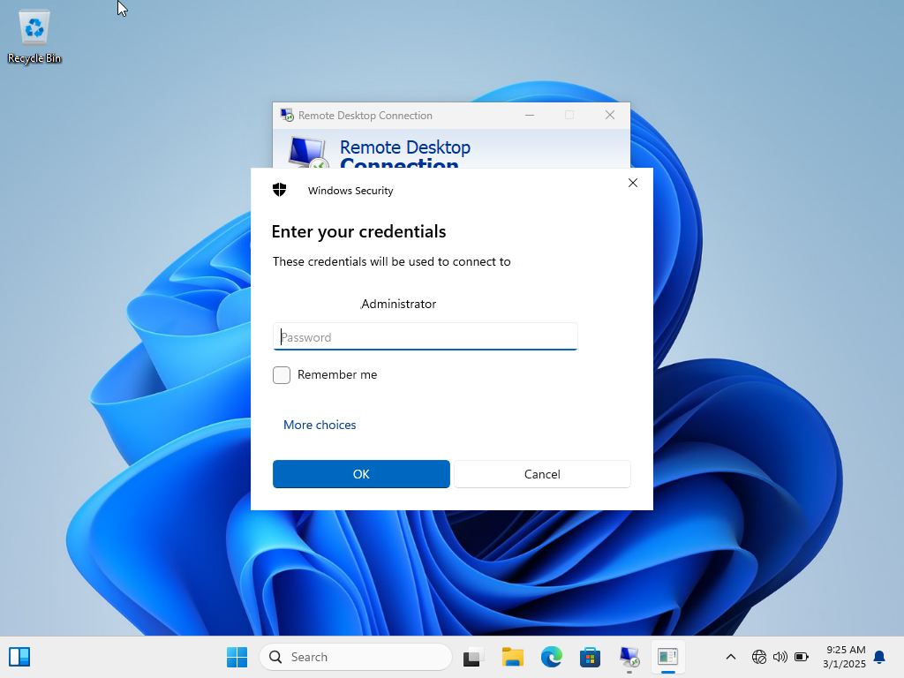
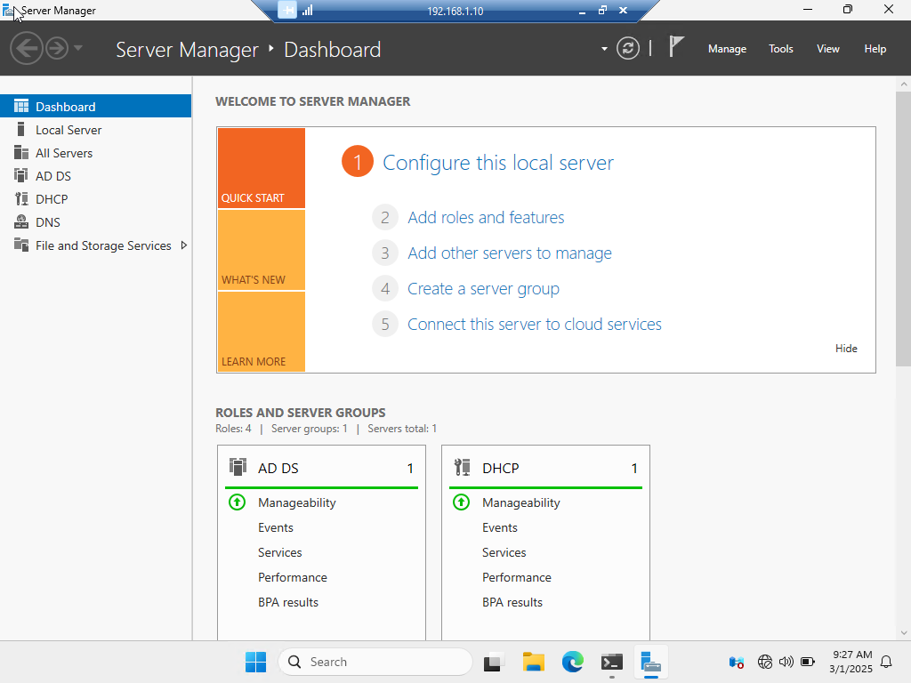
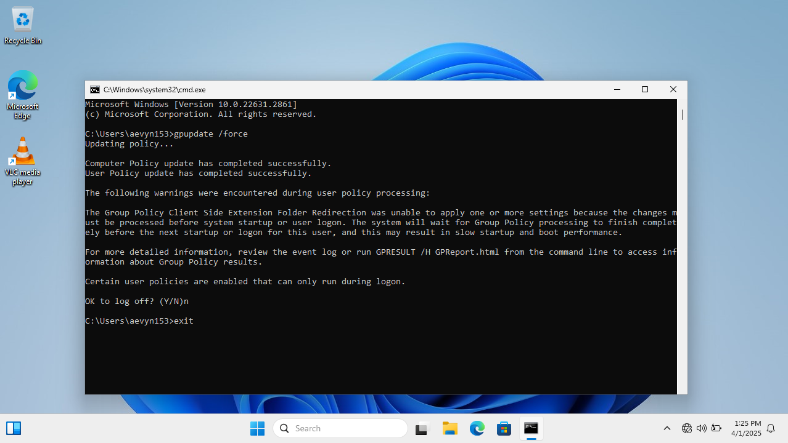
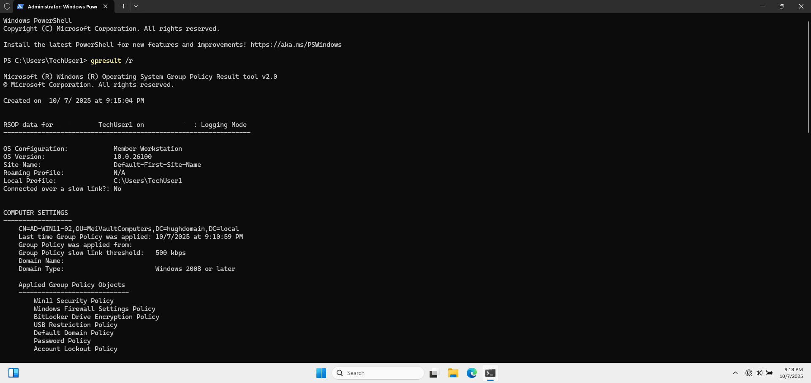
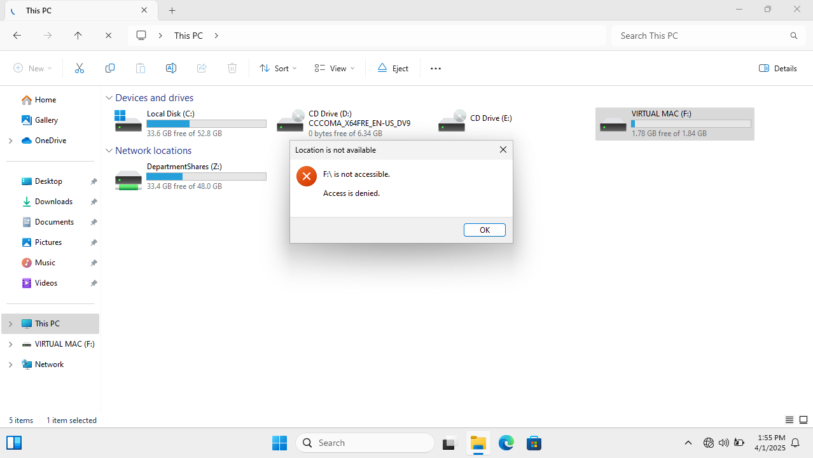
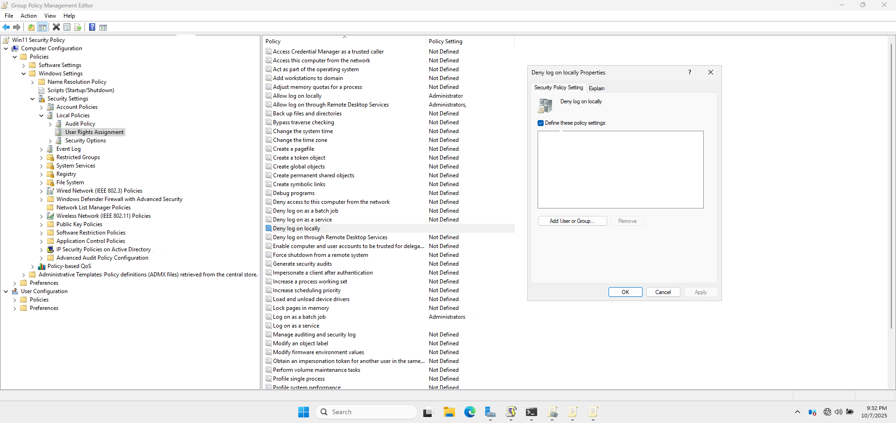
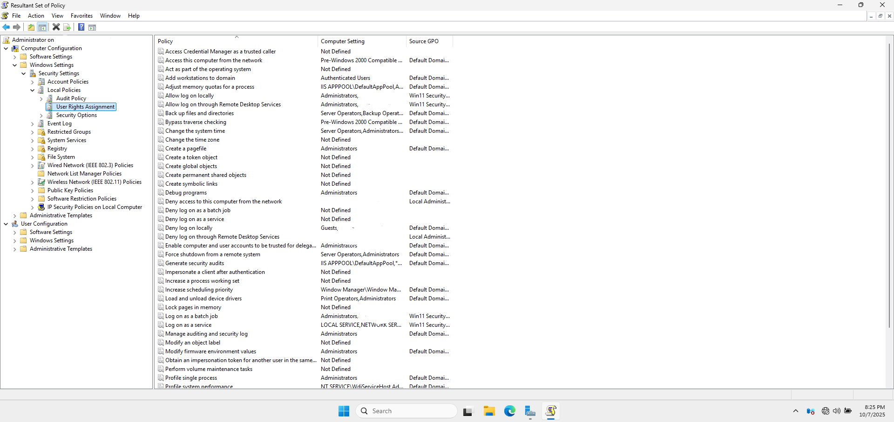

# 🔧 Common Issues & Troubleshooting

During the setup and configuration of my Active Directory Lab, I encountered a few challenges. This section documents those issues, how I identified them, and the steps I took to resolve them. Recording these solutions not only helped me deepen my understanding but also serves as a helpful reference for future troubleshooting.

---

## 🧩 1. Domain Trust Issues

**Issue:**  

Windows 10 clients failed to authenticate or access shared resources, displaying trust relationship errors.

**Root Cause:**  

Corrupted trust relationship between the domain controller and the client.

**Solution:**  

- Removed the affected computer from the domain.
- Rebooted the system.
- Rejoined it to the domain by doing the following:

   📂 `System Properties > Computer Name > Change > Workgroup → Restart → Rejoin Domain`

📸 **Error Message Showing Trust Relationship Failure**



---

## 🔐 2. RDP Access Denied for Domain Admins
**Issue:**
Domain Admins could not connect via Remote Desktop to the server.

**Root Cause:**
GPO missing or misconfigured to allow RDP access to Domain Admins group.

**Solution:**

- Edited the RDP policy GPO.

- Added `Domain Admins` to:

   📂 `Computer Configuration > Policies > Windows Settings > Security Settings > Local Policies > User Rights Assignment > Allow log on through Remote Desktop Services`

- Ran `gpupdate /force`.

📸 **RDP Access Denied**



📸 **Regaining RDP Access After Adding Domain Admins**



📸 **RDP Access Granted**



---

## 💾 3. USB Device Policy Not Applying

**Issue:**
Users could still access USB storage despite the GPO.

**Root Cause:**
GPO not applied properly or user logged in before policy propagated.

**Solution:**

Forced GPO update:

```
gpupdate /force
```
- Verified policy scope and checked security filtering.

- Ensured WMI filtering was not used.

📸 **`gpupdate` Command Output for USB Restriction**



**📸 Output from `gpresult`Command**



**📸 USB Restriction Policy Successfully Implemented**



---

## 🔒 4. Logon Denied for Domain Users

**Issue:**
Some domain users were unable to log into their computers.

**Root Cause:**
Users were added to a GPO with the **"Deny log on locally"** setting.

**Solution:**

Removed `Domain Users` group from:

   📂 `Computer Configuration > Windows Settings > Security Settings > Local Policies > User Rights Assignment > Deny log on locally`

- Rebooted affected machines.

**📸 GPO Showing Deny Log on Locally Setting**



**📸 Logon Access Denied Because Deny Logon Setting**


**📸 Resultant Set of Policy (RSoP) Output Showing Resolved Permissions**



---

## 🗂️ 5. Screenshot Storage

All screenshots for this section can be found in:<br />
📂 [`06-Screenshots/E-Troubleshooting`](../06-Screensots/E-Troubleshooting)
