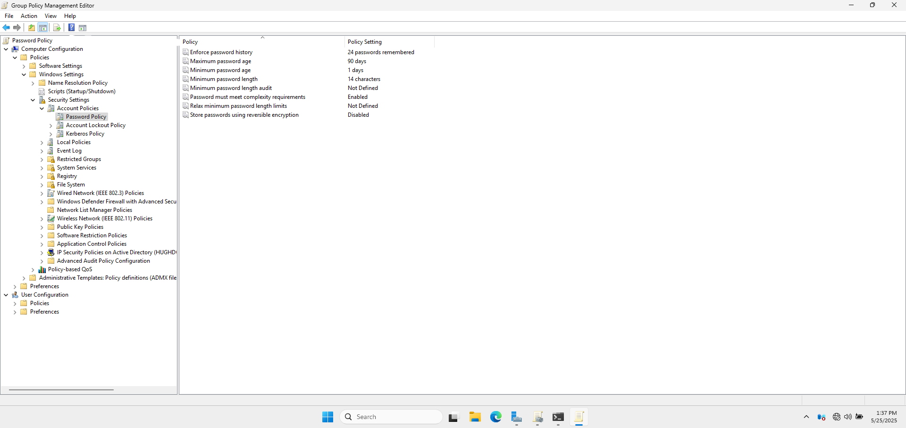

# 🔐 Password Policy GPO

## 🎯 1. Objective

To enhance account security by enforcing strong password policies across all domain users.

---

## 🛠️ 2. GPO Details

- **GPO Name:** Password Policy
- **Scope:** Applied at the domain level to ensure all users comply.

---

## ⚙️ 3. Settings Implemented

| Setting                                         | Value                   |
|-------------------------------------------------|-------------------------|
| **Enforce password history**                    | 24 passwords remembered |
| **Maximum password age**                        | 90 days                 |
| **Minimum password age**                        | 30 day                  |
| **Minimum password length**                     | 12 characters           |
| **Password must meet complexity requirements**  | Enabled                 |
| **Store passwords using reversible encryption** | Disabled                |

**📸 Password Policy Showing each Setting with its Configured Value**

---

## ✅ 4. Verification

- Used `gpresult /H report.html` to confirm the policy was applied.
- Attempted to change password to weak formats to confirm rejection.
