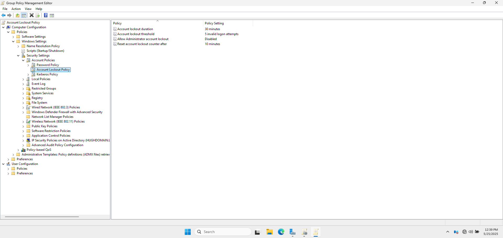

# 🚫 Account Lockout Policy GPO

## 🎯 1. Objective

To prevent brute-force logon attempts by locking user accounts after a set number of invalid login attempts.

---

## 🛠️ 2. GPO Details

- **GPO Name:** Account Lockout Policy
- **Scope:** Applied at the domain level to ensure all users comply.

---

## ⚙️ 3. Settings Implemented

| Setting                                     | Value         |
|---------------------------------------------|---------------|
| **Account lockout duration**                | 30 minutes    |
| **Account lockout threshold**               | 5 attempts    |
| **Allow Administrator account lockout**     | Disabled      |
| **Reset account lockout counter after**     | 10 minutes    |

**📸 Account Lockout Policy Showing each Individual Setting with Values Applied**

---

## ✅ 4. Verification

- Tested with dummy user accounts and incorrect passwords to ensure lockout.
- Confirmed via Event Viewer logs and GPO Management Console.
