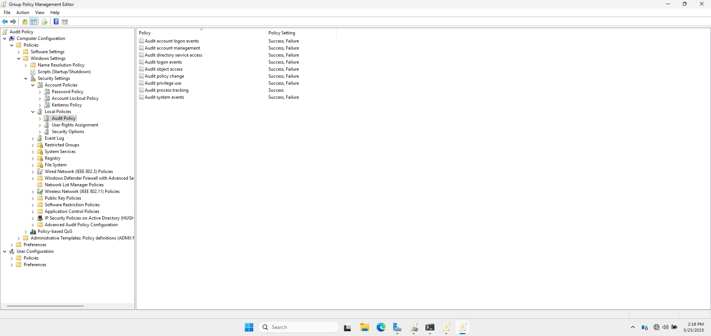

# 🔍 Audit Policy GPO

## 🎯 1. Objective
To track and monitor critical security events such as logons, account management, and policy changes.

---

## 🛠️ 2. GPO Details
- **GPO Name:** Audit Policy
- **Scope:** Applied at the domain level to ensure all users comply.

---

## 🔎 3. Categories Audited

| Category                   | Subcategory                         | Audit Type        |
|----------------------------|-------------------------------------|-------------------|
| **Account Logon**          | Credential Validation               | Success, Failure  |
| **Account Management**     | User Account Management             | Success, Failure  |
| **Detailed Tracking**      | Process Creation                    | Success           |
| **Logon/Logoff**           | Logon                               | Success, Failure  |
| **Object Access**          | File System                         | Success, Failure  |
| **Policy Change**          | Audit Policy Change                 | Success, Failure  |
| **Privilege Use**          | Sensitive Privilege Use             | Success, Failure  |
| **System**                 | Security System Extension           | Success, Failure  |

📸 **Audit Policy Configuration Window**

---

## ✅ 4. Verification
- Monitored **Security logs** in Event Viewer for expected audit events.
- Ran test logons and account changes to generate events.
