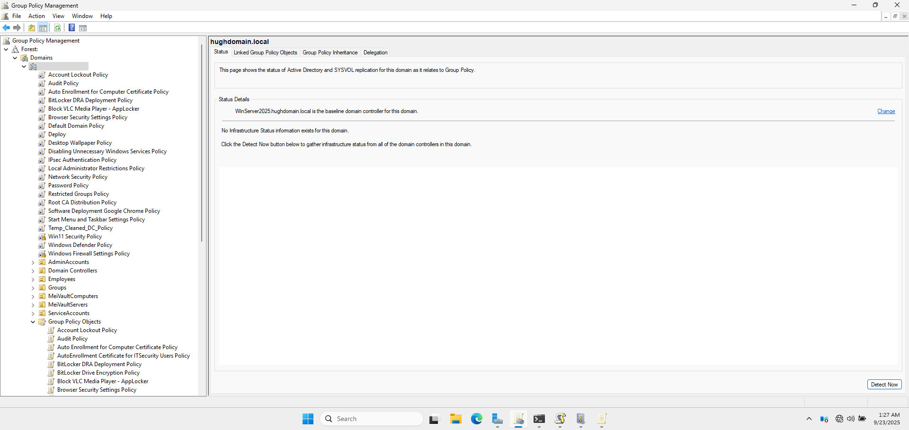
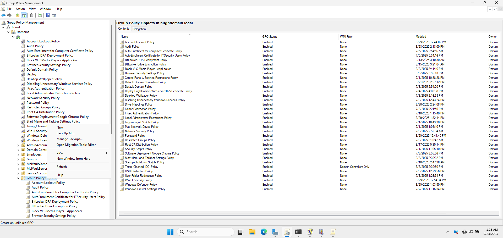
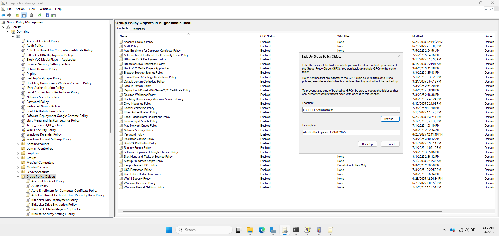
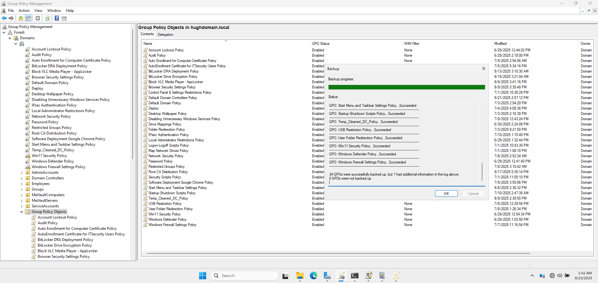
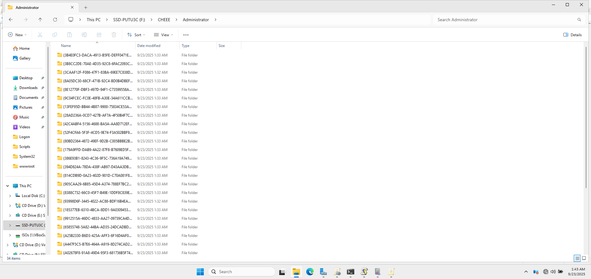

# 💾 GPO Backup via Group Policy Management Console (GPMC)

This section outlines the steps I took to manually back up **Group Policy Objects (GPOs)** using the **Group Policy Management Console (GPMC)** on the Domain Controller.

---

## 🗂️ 1. GPO Management Interface

- **Tool Used:** Group Policy Management Console (GPMC)  
- **System:** Windows Server 2025 Domain Controller  
- **Backup Method:** Manual, initiated via GPMC interface

I used the GPMC interface to initiate the backup process, ensuring that all GPOs were properly archived for future recovery or review.

📸 **GPMC Main Console Opened on Domain Controller**

---

## ⚙️ 2. Backup of All GPOs

To create a backup of **all Group Policy Objects** in the domain:

1. I navigated to `Group Policy Objects` under my domain in GPMC.
2. I right-clicked on **Group Policy Objects** and selected **"Back Up All..."** from the context menu.

📸 **Context Menu Showing 'Back Up All' Option**

3. In the backup dialog, I specified the location for the backup files (i.e., `F:\CHEEE\Administrator`) and added a description to help identify the backup.

4. I clicked the **Back Up** button to start the process.

📸 **Backup Dialog Showing Path and Description Entry**

5. A confirmation message appeared, indicating that the backup completed successfully.

📸 **Confirmation of GPO Backup Completion**

---

## 📌 4. Purpose and Justification

### 🔐 Why I Backed Up the GPOs

- To ensure **business continuity** and retain the current domain policy configuration.
- To create a **restoration point** in case of accidental changes or deletions.
- To support **audit and version control** of security and operational policies.

---

## ✅ 5. Verification

After completing the backup, I navigated to the target folder (`F:\CHEEE\Administrator`) to confirm the presence of the `.bak` files.

I also tested the restoration of one GPO on a non-production policy to verify that the backup process worked as intended.

📸 **Backup Directory with GPO .bak Files**

