# 📘 Group Policy Important Settings Guide

This guide outlines the essential Group Policy settings I configured to align with security baselines, ensure corporate compliance, and optimize user experience in a Windows enterprise environment.

---

## 🔐 1. Security Baseline Settings

### 🔑 Password Policies

**Path:**  
📂 `Computer Configuration > Policies > Windows Settings > Security Settings > Account Policies > Password Policy`

| Setting                                                 | Value                   |
|---------------------------------------------------------|-------------------------|
| **Enforce password history**                            | 24 passwords remembered |
| **Maximum password age**                                | 90 days                 |
| **Minimum password age**                                | 30 day                   |
| **Minimum password length**                             | 14 characters           |
| **Password must meet complexity requirements**          | Enabled                 |
| **Store passwords using reversible encryption**         | Disabled                |

📸 **Password Policies Settings**

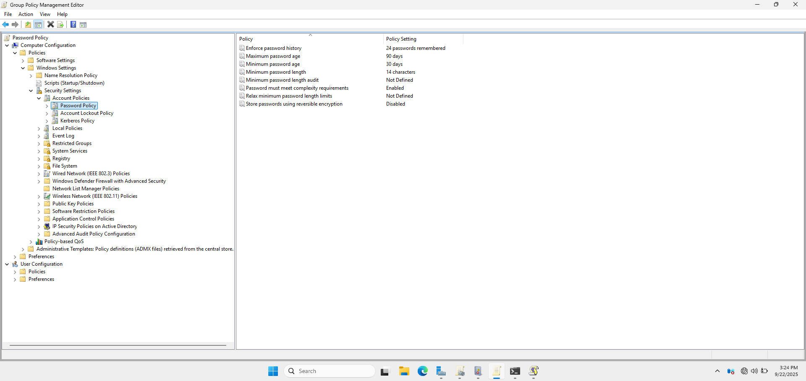

---

### 🚫 Account Lockout Policies

**Path:**  
📂 `Computer Configuration > Policies > Windows Settings > Security Settings > Account Policies > Account Lockout Policy`

| Setting                                        | Value              |
|------------------------------------------------|--------------------|
| **Account lockout duration**                   | 30 minutes         |
| **Account lockout threshold**                  | 5 invalid attempts |
| **Reset account lockout counter after**        | 30 minutes         |

📸 **Account Lockout Policies Settings**

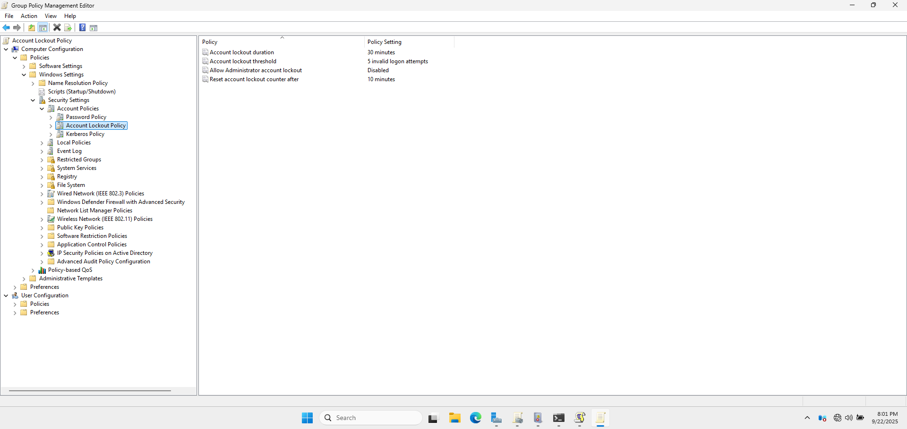

---

### 👤 User Rights Assignment

**Path:**  
📂 `Computer Configuration > Policies > Windows Settings > Security Settings > Local Policies > User Rights Assignment`

| Setting                                             | Assigned To                                                                                                                      |
|-----------------------------------------------------|----------------------------------------------------------------------------------------------------------------------------------|
| **Access this computer from the network**           | Authenticated Users                                                                                                              |
| **Allow log on locally**                            | Administrators, HUGHDOMAIN\Administrator, HUGHDOMAIN\BackupAdmin, HUGHDOMAIN\BackupAdmin1, Domain Users, Users                   |
| **Allow log on through Remote Desktop Services**    | Administrator, Administrators, HUGHDOMAIN\Administrator, HUGHDOMAIN\BackupAdmin, HUGHDOMAIN\BackupAdmin1, Remote Desktop Users   |
| **Deny access to this computer from the network**   | Local Admins, Guest                                                                                                              |
| **Deny log on locally**                             | Guest                                                                                                                            |
| **Log on as a batch job**                           | Administrators, HUGHDOMAIN\BackupAdmin, HUGHDOMAIN\BackupAdmin1                                                                  |
| **Log on as a service**                             | Network Service, Local Service                                                                                                   |
| **Shut down the system**                            | Administrators, HUGHDOMAIN\BackupAdmin, HUGHDOMAIN\BackupAdmin1                                                                  |

---

### 🛡️ Security Options

**Path:**  
📂 `Computer Configuration > Policies > Windows Settings > Security Settings > Local Policies > Security Options`

| Setting                                                                    | Value                                                                                                       |
|------------------------------------------------------------------------------------------------------------------------------|---------------------------------------------------------------|
| **Interactive logon: Do not display last user name**                                                                         | Enabled                                                       |
| **Microsoft network client: Digitally sign communications (always)**                                                         | Enabled                                                       |
| **Microsoft network client: Digitally sign communications (if server agrees)**                                               | Enabled                                                       |
| **Microsoft network server: Digitally sign communications (always)**                                                         | Enabled                                                       |
| **Microsoft network server: Digitally sign communications (if client agrees)**                                               | Enabled                                                       |
| **Network security: LAN Manager authentication level**                                                                       | Send NTLMv2 response only. Refuse LM & NTLM                   |
| **Network security: Minimum session security for NTLM SSP based (including secure RPC) clients**                             | Require NTLMv2 session security, Require 128-bit encryption   |
| **Network security: Minimum session security for NTLM SSP based (including secure RPC) server**                              | Require NTLMv2 session security, Require 128-bit encryption   |
| **User Account Control: Behaviour of the elevation prompt for administrators in Admin Mode**                                 | Prompt for consent on secure desktop                          |
| **User Account Control: Behaviour of the elevation prompt for administrators running with enhanced privilege protection**    | Prompt for consent on secure desktop                          |
| **User Account Control: Run all administrators in Admin Approval Mode**                                                      | Enabled                                                       |
---

### 🦠 Windows Defender Settings

#### 🛡️ Microsoft Defender Antivirus

**Path:**  
📂 `Computer Configuration > Policies > Administrative Templates > Windows Components > Microsoft Defender Antivirus`

| Setting                                                      | Value             |
|--------------------------------------------------------------|-------------------|
| **Join Microsoft Maps**                                      | Enabled           |
| **Configure removal of items from Quarantine folder**        | Enabled           |
| **Turn off real-time protection**                            | Disabled          |
| **Turn on behaviour monitoring**                             | Enabled           |
| **Scan all downloaded file and attachments**                 | Enabled           |
| **Monitor file and program activity on your computer**       | Enabled           |
| **Scan removable drives**                                    | Enabled           |
| **Specify the scan type ro use for a scheduled scan**        | 2 - Full scan     |
| **Specify the day of the week to run a scheduled scan**      | Enabled           |
| **Specify the time of day to run a scheduled scan**          | Enabled           |
| **Turn off Microsoft Defender Antivirus**                    | Disabled          |

📸 **Windows Defender Settings**

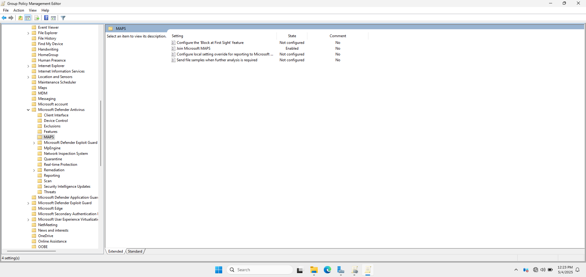

📸 **Windows Defender Settings**

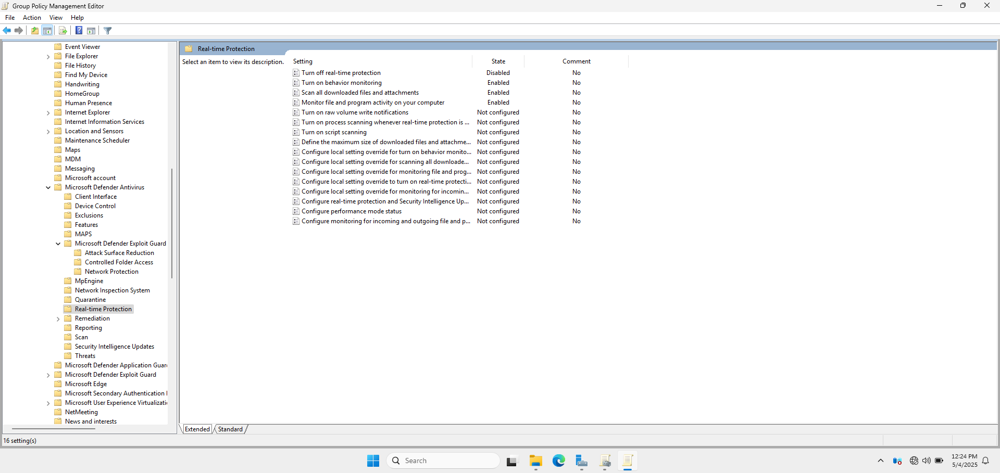

📸 **Windows Defender Settings**

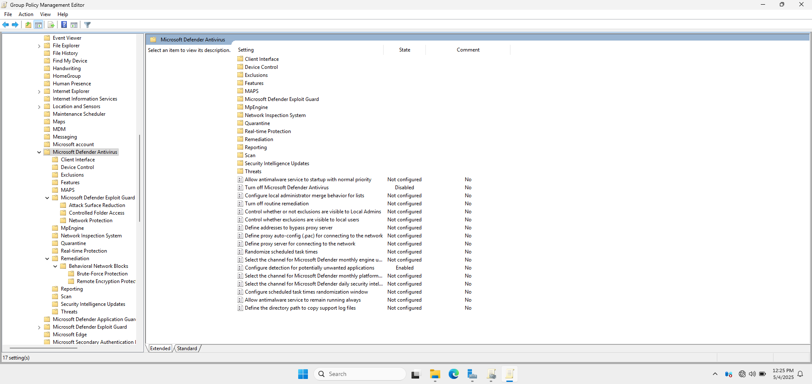

---

### 🔥 Windows Defender Firewall

**Path:**  
📂 `Computer Configuration > Policies > Windows Settings > Security Settings > Windows Defender Firewall with Advanced Security`

| Profile Type         | Firewall State | Inbound Connections  | Outbound Connections  |
|----------------------|----------------|----------------------|-----------------------|
| **Domain Profile**   | On             | Block (default)      | Allow (default)       |
| **Private Profile**  | On             | Block (default)      | Allow (default)       |
| **Public Profile**   | On             | Block (default)      | Allow (default)       |

📸 **Windows Defender Firewall Settings**

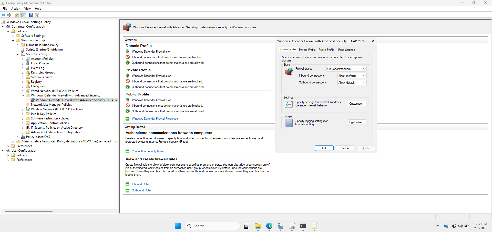

---

## 🖥️ 2. Desktop and Start Menu Settings

### 🖼️ Desktop Settings

**Path:**  
📂 `User Configuration > Policies > Administrative Templates > Desktop`

- **Desktop Wallpaper:** Set to corporate wallpaper
- **Desktop Icons:** Control icons on desktop

📸 **Desktop Settings**

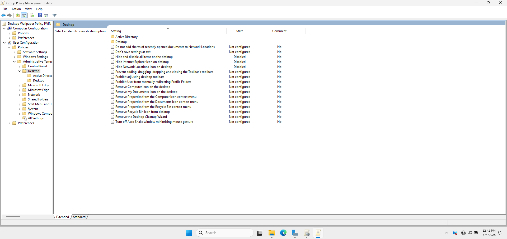

### 📋 Start Menu and Taskbar

**Path:**  
📂 `User Configuration > Policies > Administrative Templates > Start Menu and Taskbar`

- Remove access to taskbar context menus: Disabled  
- Remove "Search the Internet" link: Enabled  
- Do not allow pinning items in Jump Lists: Disabled  
- Turn off user tracking: Enabled

📸 **Start Menu and Taskbar Settings**

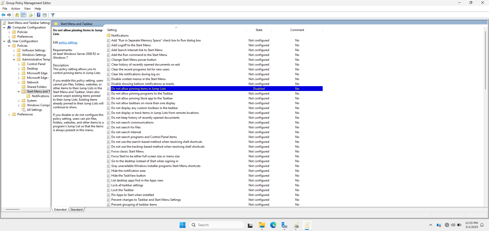

---

### 🔄 Windows Update Settings

#### 🔧 Windows Update for Business

**Path:**  
📂 `Computer Configuration > Policies > Administrative Templates > Windows Components > Windows Update > Windows Update for Business`

| Setting                                                  | Value                         |
|----------------------------------------------------------|-------------------------------|
| **Preview Builds and Feature Updates**                   | Enabled, Semi-Annual, 30 days |
| **Quality Updates**                                      | Enabled, 7 days deferral      |
| **Configure Automatic Updates**                          | Enabled                       |
| **Configure automatic updating**                         | 4 - Auto download & schedule  |
| **Scheduled install day**                                | 0 - Every day                 |
| **Scheduled install time**                               | 03:00                         |

📸 **Windows Update Settings**

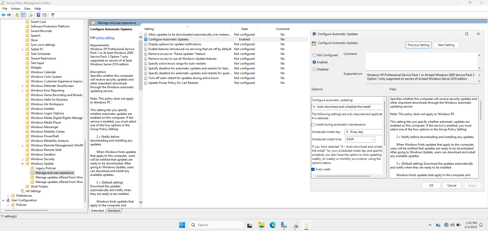

---

### 🌐 Internet Explorer and Microsoft Edge

#### 🌎 Microsoft Edge Settings

**Path:**  
📂 `Computer Configuration > Policies > Administrative Templates > Microsoft Edge`

- `Action to take on Microsoft Edge startup`: Enabled
- `Allow users to be alerted if their passwords are found to be unsafe`: Enabled
- `Block external extensions from being installed`: Enabled
- `Block tracking of user's web-browsing activity`: Enabled
- `Block pop-ups`: Enabled
- `Configure Do Not Track`: Enabled  
- `Configure Microsoft Defender SmartScreen`: Enabled
- `Configure Microsoft Defender SmartScreen to block potentially unwanted apps` Enabled
- `Configure the homepage URL`: Enabled
- `Configure the new tab URL`: Enabled
- `Enable saving passwords to the password manager Password Manager`: Disabled
- `Default search provider`:** Set to corporate engine
- `Set the new tab page as the home page`: Enabled
- `Show Home button on toolbar`: Enabled
- `Sites to open when the browser starts`: Enabled 
- `Prevent bypassing of Microsoft Defender SmartScreen warnings about downloads`: Enabled 

📸 **Microsoft Edge Settings**

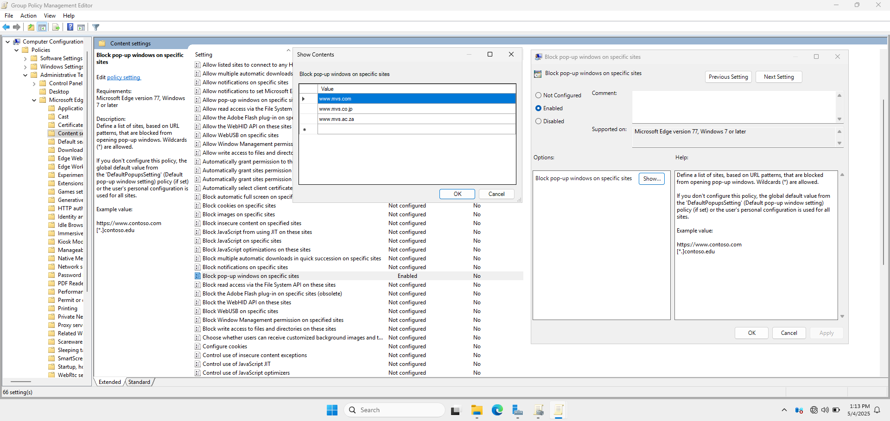

---

### 🧩 Administrative Templates

#### ⚙️ Control Panel

**Path:**  
📂 `User Configuration > Policies > Administrative Templates > Control Panel`

- **Prohibit access to Control Panel and PC settings:** Enabled

📸 **Control Panel Settings**

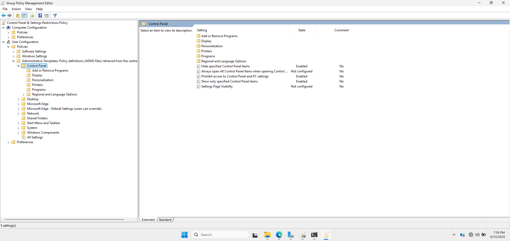
#### 💻 System

**Path:**  
📂 `Computer Configuration > Policies > Administrative Templates > System`

- Turn off DEP for Explorer: Disabled  
- Turn off heap termination on corruption: Disabled  
- Don’t display Getting Started screen: Enabled

📸 **System Settings**

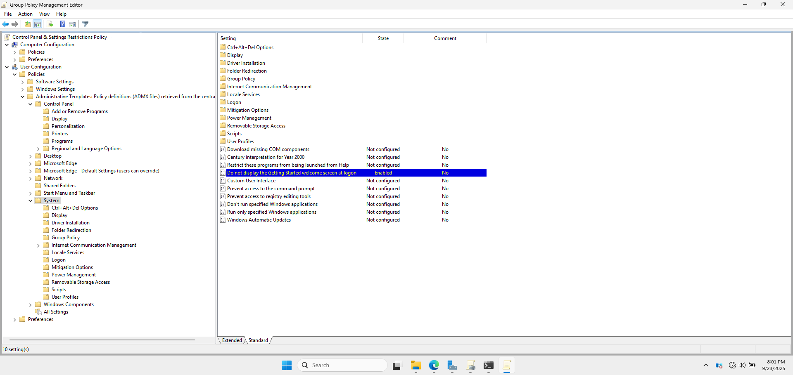
📸 **System Settings**

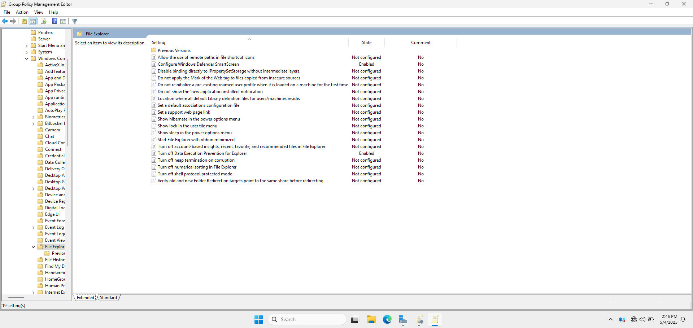

#### 🌐 Network

**Path:**  
📂 `Computer Configuration > Policies > Administrative Templates > Network`

- Prohibit Internet Connection Sharing on DNS domain network: Enabled  
- Route all traffic through internal network: Enabled (for VPN)

📸 **Network Settings**

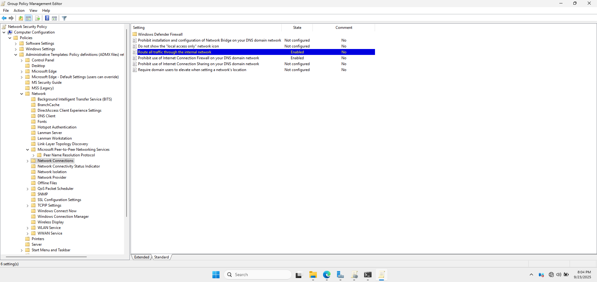

---

#### 🔋 Power Management

**Path:**  
📂 `Computer Configuration > Policies > Administrative Templates > System > Power Management`

- Active power plan: Enabled, set to "Balanced"  
- Hibernate timeout (plugged in): Enabled, set accordingly  
- Turn off hybrid sleep (plugged in): Enabled  
- Require password on wake (plugged in): Enabled

📸 **Power Management Settings**

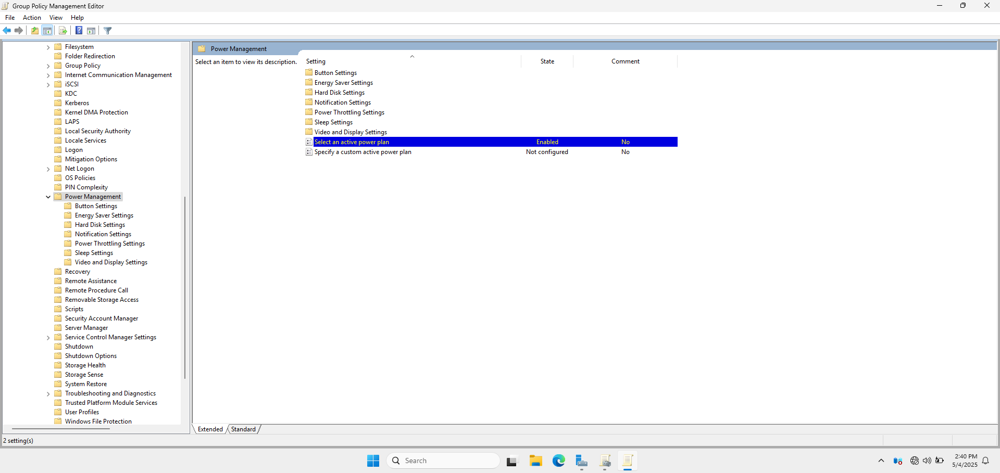

---

### 🏢 Corporate Compliance Settings

#### 🛡️ Data Loss Prevention

**Path:**  
📂 `Computer Configuration > Policies > Administrative Templates > Windows Components > File Explorer`

- Block copying to removable drives: Enabled  
- Windows SmartScreen: Enabled  
- DEP: Disabled

#### 🔐 BitLocker Drive Encryption

**Path:**  
📂 `Computer Configuration > Policies > Administrative Templates > Windows Components > BitLocker Drive Encryption`

- OS Drives > Require additional auth at startup: Enabled  
- OS Drives > Enable keyboard input on slates: Enabled  
- Fixed Data Drives > Use passwords: Enabled  
- Removable Drives > Deny write if no BitLocker: Enabled

📸 **BitLocker Drive Encryption Settings**

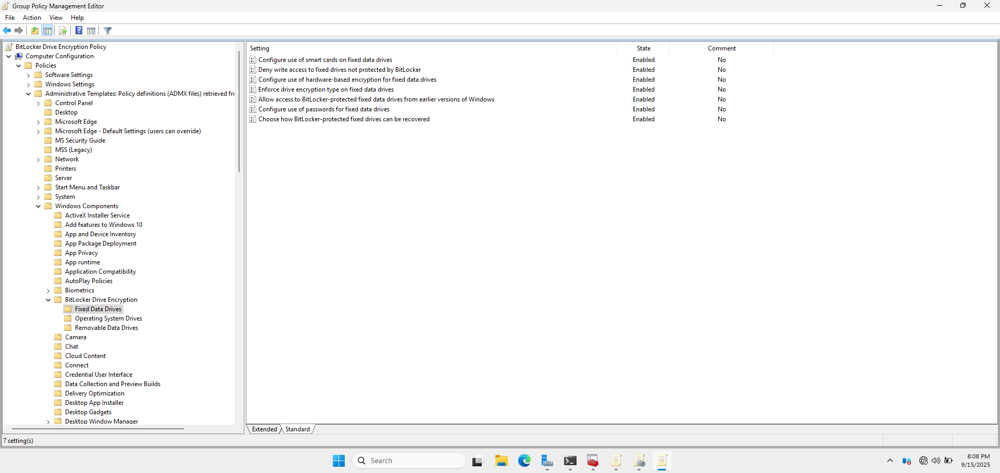

---

### 📦 Application Control

#### 📋 AppLocker

**Path:**  
📂 `Computer Configuration > Policies > Windows Settings > Security Settings > Application Control Policies > AppLocker`

- Executable Rules: Create Default Rules & Custom Rules 
- Windows Installer Rules: Create Default Rules & Custom Rules  
- Script Rules: Create Default Rules & Custom Rules  
- Packaged App Rules: Create Default Rules & Custom Rules

📸 **AppLocker Settings Executable Rules Settings**

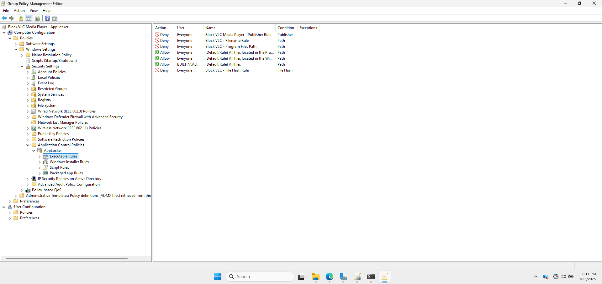

---

### 📁 App Package Deployment

**Path:**  
📂 `Computer Configuration > Policies > Administrative Templates > Windows Components > App Package Deployment`

- Allow deployment operations in special profiles: Disabled  
- Prevent non-admin users from installing packaged Windows apps: Enabled

📸 **App Package Deployment Settings**

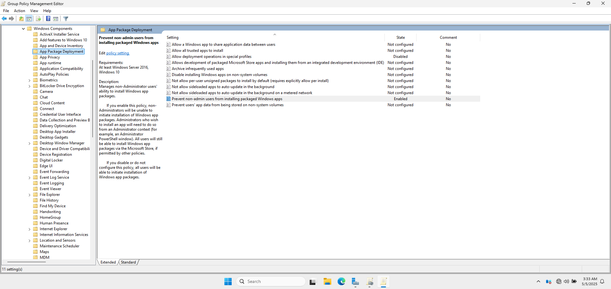

---

### 🔧 Device Installation

**Path:**  
📂 `Computer Configuration > Policies > Administrative Templates > System > Device Installation > Device Installation Restrictions`

- Prevent install by device ID: Enabled (`PCI\VEN_8086&DEV_1C3A`, `USB\VID_0781&PID_5583`, `USB\VID_05AC&PID_12A8`)  
- Prevent install by setup class: Enabled (`{4d36e967-e325-11ce-bfc1-08002be10318}`)

📸 **Device Installation Settings**

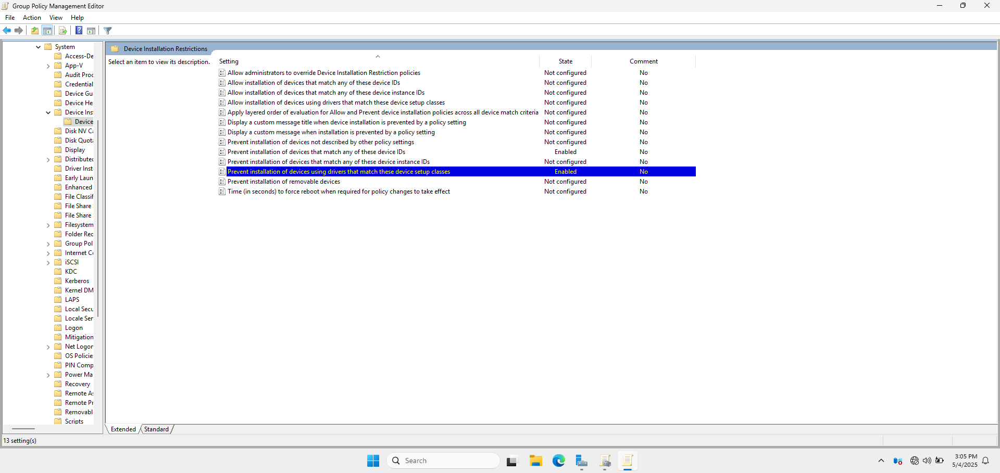
