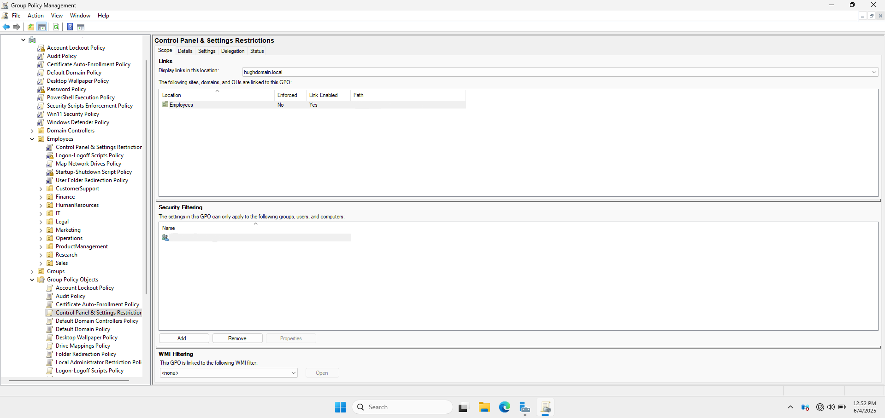
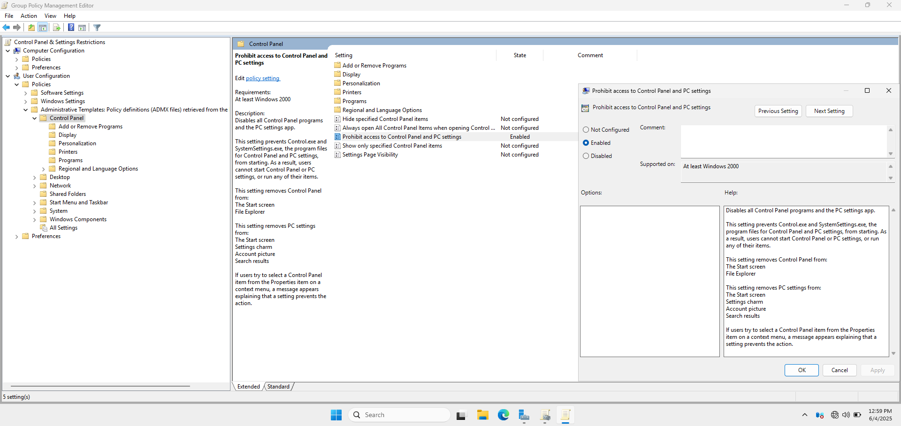
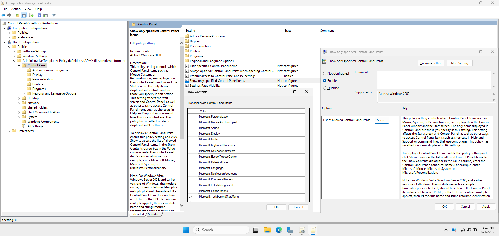
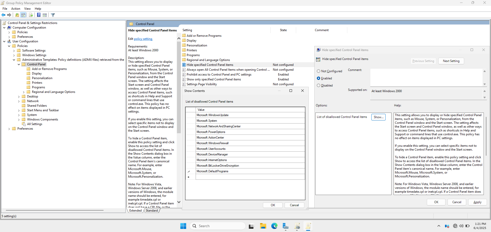

# 🔧 Control Panel & Settings Restrictions Policy

This section explains how I implemented **Control Panel and Settings Restrictions** via Group Policy to prevent standard users from accessing system settings. This increases security and reduces the risk of misconfiguration or unauthorized system changes.

---

## 🏷️ 1. GPO Name

- **GPO Name:** Control Panel & Settings Restrictions Policy 
- **Linked To:** Tech OU

📸 **Group Policy Management Console Showing the Control Panel Restrictions GPO and Link**

---

## 🛠️ 2. Policy Configuration Steps

1. Navigated to:  
   📂 `User Configuration > Policies > Administrative Templates > Control Panel`

2. Enabled the policy:  
   `Prohibit access to Control Panel and PC settings`

📸 **Policy Setting - Prohibit Access to Control Panel**

3. Additionally verified these related settings:
   - Enabled the Hide specified Control Panel items policy 
   
   📸 **Control Panel Restrictions Showing Only Specified Control Panel Items**
   

   
   - Enabled the Show only specified Control Panel items policy.

  📸 **Control Panel Restrictions Showing Disallowed Control Panel Items**
  

---

## 🚫 3. User Experience

After applying the policy, users:
- Receive an error message when attempting to open Control Panel or Windows Settings.
- Are unable to make changes to system configurations.

📸 **Control Panel Access Blocked Message**

---

## ✅ 4. Testing and Results

To verify the policy:
1. Logged into a domain-joined Windows 11 client as a standard user.
2. Attempted to open Control Panel and Settings.
3. Verified that both were blocked successfully.
