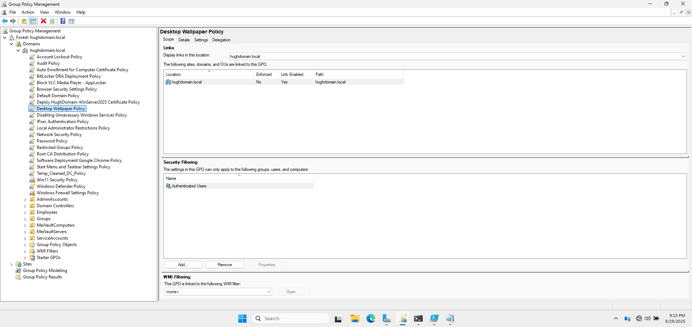
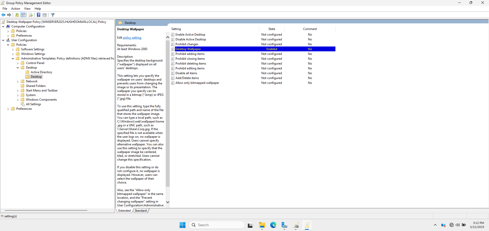

# 🖼️ Desktop Wallpaper Policy

This section explains how I implemented a **Desktop Wallpaper Policy** using Group Policy to enforce a consistent desktop background across all user machines in the domain. This helps standardize branding and minimizes distractions in a corporate environment.

---

## 🏷️ 1. GPO Name

- **GPO Name:** Desktop Wallpaper Policy  
- **Linked To:** cloud.com (domain root)

📸 **Group Policy Management Console Showing the Desktop Wallpaper Policy GPO and Link**

---

## 🛠️ 2. Policy Configuration Steps

1. Navigated to:  
   📂 `User Configuration > Policies > Administrative Templates > Desktop > Desktop`

2. Enabled the setting:  
   `Desktop Wallpaper`

3. Specified the path to the wallpaper image:  
   `\\WINSERVER2022\sysvol\cloud.com\Wallpaper`

4. Set wallpaper style to:  
   `Fit`

📸 **Desktop Wallpaper Policy Configuration**

---

## ✅ 3. Testing and Results

To test the policy:
1. Logged into a domain-joined client machine as a standard user.
2. Verified that the desktop wallpaper was automatically applied.
3. Attempted to change the wallpaper via settings — confirmed that the option was greyed out.

📸 **Wallpaper Automatically Applied on User Login**

