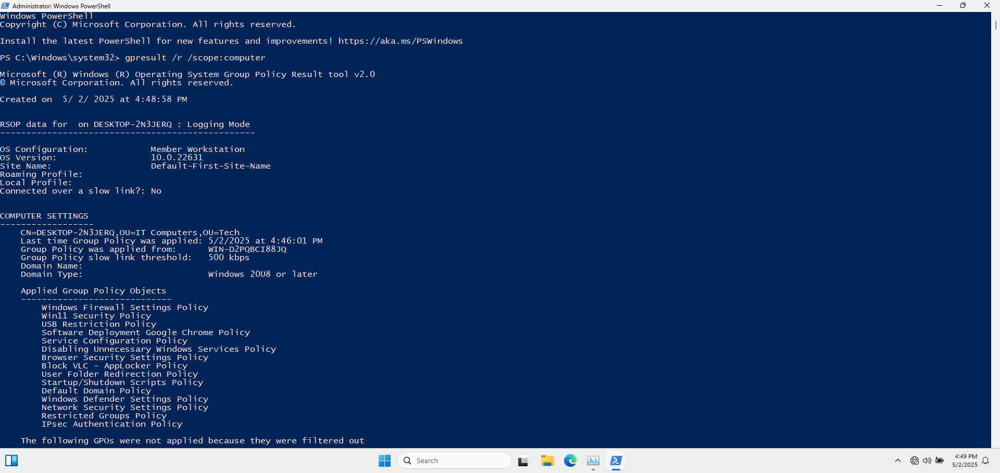
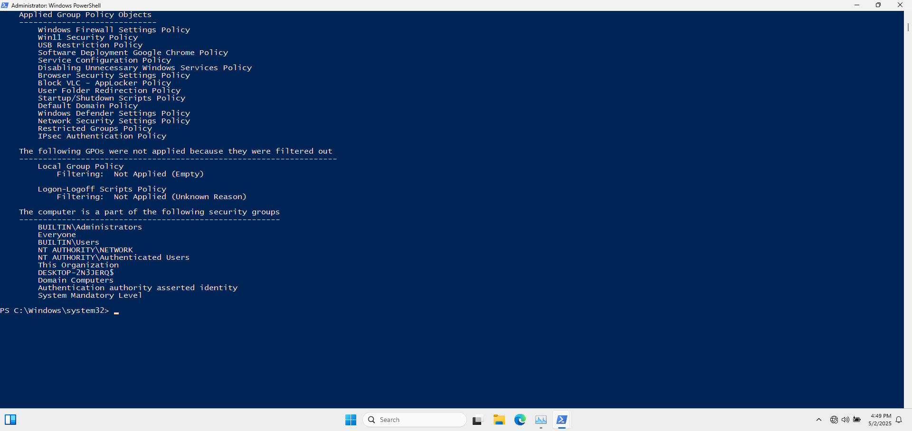
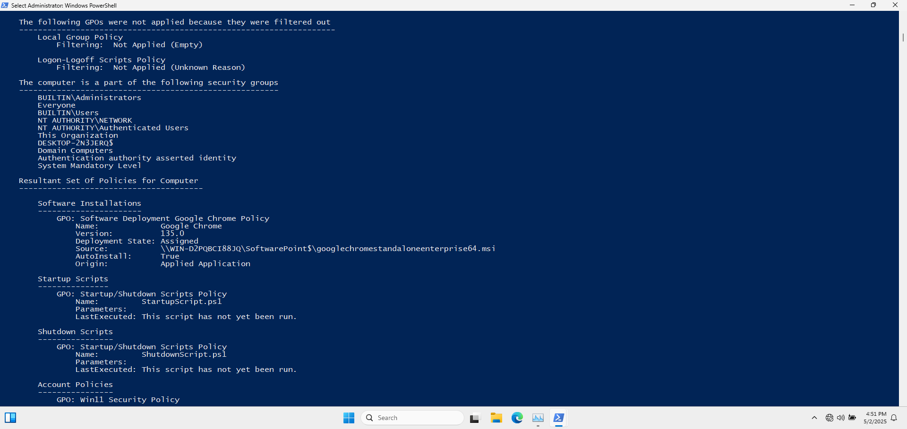
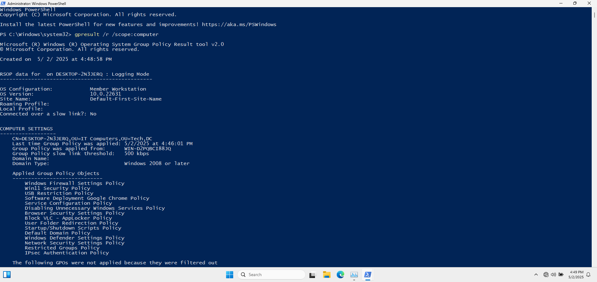
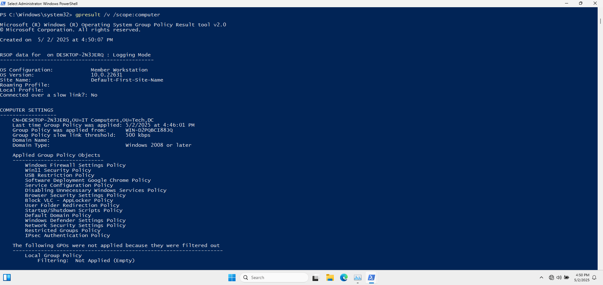

# 🖥️ Computer GPO Report

## 🏷️ 1. Applied Group Policy Objects

- **Default Domain Policy**
- **Windows Defender Configuration**
- **Block VLC - Policy**
- **Browser Security Settings Policy**
- **Control Panel Restrictions**
- **Default Domain Controller Policy**
- **Default Domain Policy**
- **Desktop Wallpaper Policy**
- **Disabling Unnecessary Windows Services Policy**
- **Drive Mappings Policy**
- **IPsec Authentication Policy**
- **Logon-Logoff Scripts Policy**
- **Map Network Drives Policy**
- **Network Security Settings Policy**
- **Restricted Groups Policy**
- **Service Configuration Policy**
- **Software Deployment Google Chrome Policy**
- **Start Menu and Taskbar Settings Policy**
- **Startup/Shutdown Scripts Policy**
- **USB Restriction Policy**
- **User Folder Redirection Policy**
- **Win11 Security Policy**
- **Windows Defender Settings Policy**
- **Windows Firewall Settings Policy**

📸 **Applied GPOs - Computer Scope**

---

## 🚫 2. GPOs Not Applied

- **Local Group Policy**: Not applied (empty).
- **Logon-Logoff Scripts Policy Group Policy**: Not applied (Unknown Reason).

📸 **Filtered GPOs - Computer Scope**

---

## 🛂 3. Security Group Memberships

- `BUILTIN\Administrators`
- `Everyone`
- `BUILTIN\Users`
- `NT AUTHORITY\NETWORK`
- `NT AUTHORITY\Authenticated Users`
- `This Organization`
- `DESKTOP-2N3JERQ$`
- `Domain Computers`
- `Authenticated authority asserted identity`
- `System Mandatory Level`

📸 **Security Groups - Computer Scope**

📸 **Last GP Update - Computer Scope**

---

## 🖌️ 4. Additional Screenshots

### A. Command Prompt Output: `gpresult /r /scope:computer`

#### 📝 Description

Displays a summary of computer-specific Group Policy settings.

#### 🎯 Purpose

Provides a quick overview of applied GPOs and system information.
   - `Capture Location`: Client Machine
     
📸 **Command Prompt Output: `gpresult /r /scope:computer`**
   

### B. Command Prompt Output: `gpresult /v /scope:computer`

#### 📝 Description 

Shows verbose details of computer policies.

#### 🎯 Purpose
Offers in-depth information on each policy setting applied to the computer.
   - `Capture Location`: Client Machine

### C. **Group Policy Results Wizard in GPMC (Computer Configuration)**
   
#### 📝 Description 

Screenshot of the Group Policy Results Wizard displaying computer configuration results.

#### 🎯 Purpose

Visual representation of GPOs applied to the computer, aiding in analysis and troubleshooting.
   - `Capture Location`: Domain Controller
   
---

### D. HTML Report Generated by `gpresult /h`

#### 📝 Description 

Snapshot of the HTML report focusing on the computer configuration section.

#### 🎯 Purpose

Provides a formatted and comprehensive view of applied policies.
   - `Capture Location`: Client Machine

---

## 🔄 5. Last Group Policy Application

- **Date**: 2025-05-02
- **Time**: 4:46 PM
- **Domain Controller**: WIN-D2PQBCI88JQ.cloud.com
