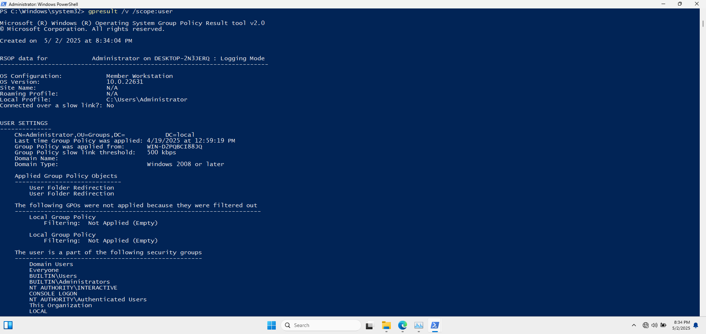
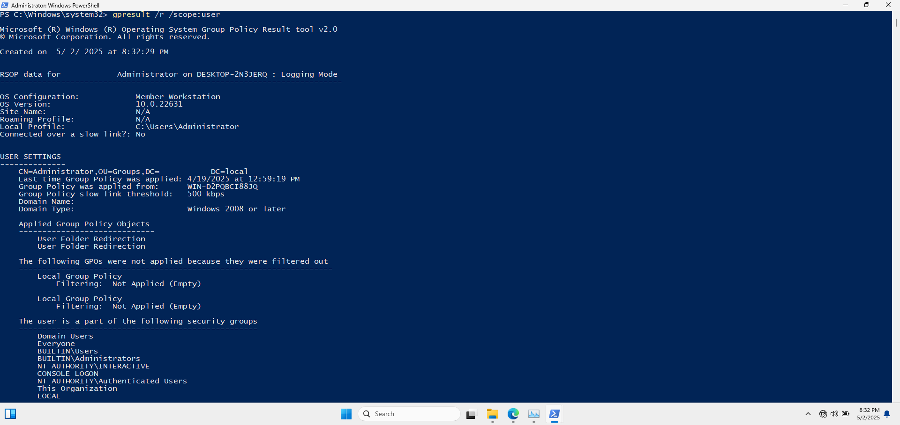
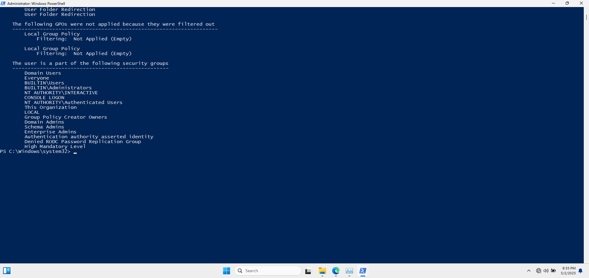
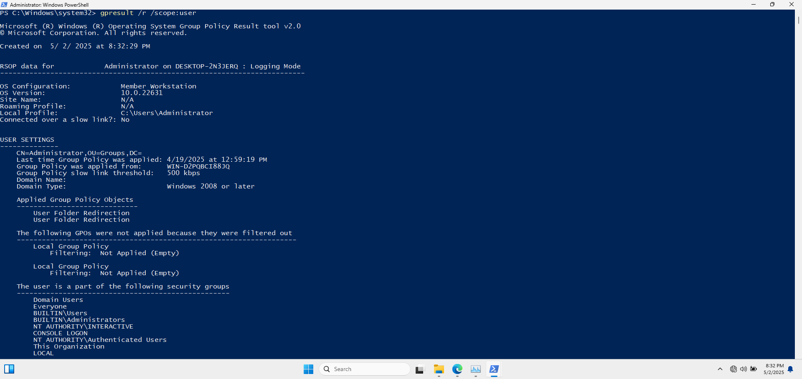
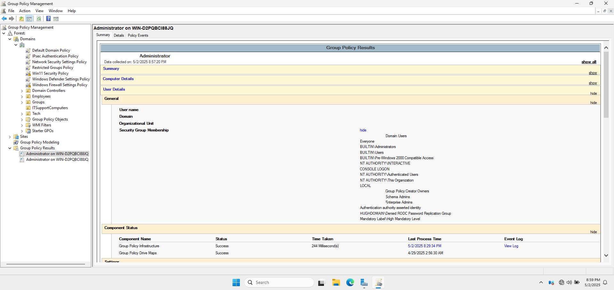
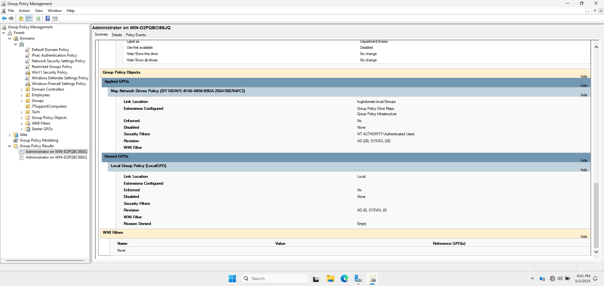

# 👤 User GPO Report

## 🏷️ 1. Applied Group Policy Objects

- **User Folder Redirection Policy**

📸 **Applied GPOs - User Scope**

---

## 🚫 2. GPOs Not Applied

- **Local Group Policy**: Not applied (empty).

📸 **Filtered GPOs - User Scope**

---

## 🛂 3. Security Group Memberships

- `Domain Users`
- `Everyone`
- `BUILTIN\Users`
- `BUILTIN\Administrators`
- `NT AUTHORITY\INTERACTIVE`
- `CONSOLE LOGON`
- `NT AUTHORITY\Authenticated Users`
- `This Organization`
- `LOCAL`
- `Group Policy Creator Owners`
- `Domain Admins`
- `Schema Admins`
- `Enterprise Admins`
- `Authentication authority asserted identity`
- `Denied RODC Password Replication Group`
- `High Mandatory Level`

📸 **Security Groups - User Scope**

📸 **Last GP Update - User Scope**

---

## 🖌️ 4. Additional Screenshots

### A. Command Prompt Output: `gpresult /r /scope:user`

#### 📝 Description

Displays a summary of user-specific Group Policy settings

#### 🎯 Purpose

Offers a concise view of GPOs applied to the user account.
   - `Capture Location`: Client Machine
     
📸 **Command Prompt Output: `gpresult /r /scope:user`**
   

### B. Command Prompt Output: `gpresult /v /scope:user`

#### 📝 Description 

Shows verbose details of user policies.

#### 🎯 Purpose

Provides detailed insights into each policy setting applied to the user.
   - `Capture Location`: Client Machine
   
### C. **Group Policy Results Wizard in GPMC (User Configuration)**
   
#### 📝 Description 

Screenshot of the Group Policy Results Wizard displaying user configuration results.

#### 🎯 Purpose

Visual representation of GPOs applied to the user, facilitating better understanding.
   - `Capture Location`: Domain Controller

📸 **GPMC - User Configuration:**

  

---

### D. HTML Report Generated by `gpresult /h`

#### 📝 Description 

Snapshot of the HTML report focusing on the user configuration section.

#### 🎯 Purpose 

Offers a structured and detailed view of applied user policies.
   - `Capture Location`: Client Machine

---

## 🔄 5. Last Group Policy Application

- **Date**: 2025-05-02
- **Time**: 4:46 PM
- **Domain Controller**: WIN-D2PQBCI88JQ.cloud.com
